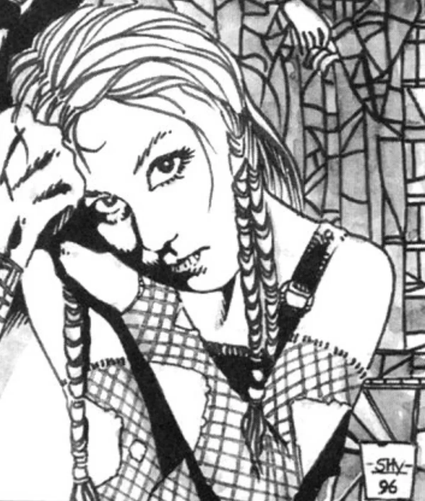

<dl>
<dt>Clan</dt><dd>Brujah antitribu</dd>
<dt>Generation</dt><dd>10th generation</dd>
<dt>Role</dt><dd>War-doll of the Shepherds</dd>
<dt>City</dt><dd>Montreal</dd>
</dl>

The war-doll of the Shepherds, Cherubim is the product of the vile practices of the Sabbat. Born in 1860, Alice Menard fell into the clutches of [Kyle](/npcs/kyle-strathcona/) McConner, a Brujah antitribu pedophile, when she was five. Abused and raped for over a year, she was also victimized by [Kyle](/npcs/kyle-strathcona/)'s Vicissitude, which he used to make Alice look like a porcelain doll. He then put her through the Creation Rites, and she remained his into the 20th century.

[Raphael Catarari](/npcs/raphael-catarari/) recognized Alice's beautiful soul and helped her become strong enough to free herself. In 1911, she overcame the Vinculum that bound her to [Kyle](/npcs/kyle-strathcona/), then challenged him to Monomancy, during which he was hampered by his own twisted affections. [Raphael](/npcs/raphael-catarari/) brought her into the Shepherds and onto their Path as Cherubim.

The specter of Kyle McConner haunts Cherubim. (She still keeps the leather mask that he wore while violating her.) When her Divine Tide rises, she struggles to let go of her hatred. During periods of ebb tide, she seeks vengeance by pursuing a twisted game of seduction aimed at mortal men. She brings out the pedophile in them and then tears out their hearts at the point of sexual climax.

Cherubim and [Raphael](/npcs/raphael-catarari/) have begun an intensely sexual relationship. Part of Cherubim feels that the Shepherd is nothing but another pedophile who is using her. She suppresses a deadly frenzy at the peak of their bloody sexual acts.

**Image:** Cherubim's diminutive form features over-sized glassy eyes, a rosy face and a large, round head. She wears leather clothes, her hair in colored braids, and carries weighted throwing daggers and a curved carving knife. She tries to look less like a plaything.
