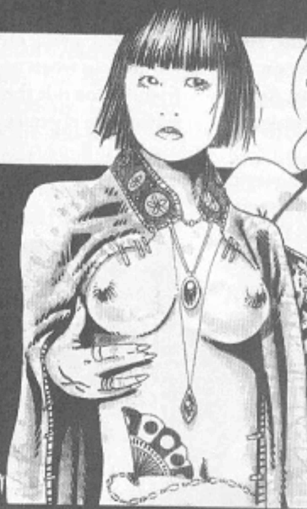

<dl>
<dt>Clan</dt><dd>Toreador antitribu</dd>
<dt>Generation</dt><dd>10th generation</dd>
<dt>Role</dt><dd>Cathari Perfecti (co-leader with The Rose), sculptor</dd>
<dt>City</dt><dd>Montreal</dd>
</dl>

Monique Kim was born and raised in Montreal, but her past is deeply rooted in her Chinese heritage. Her family lived in the core of Chinatown, where her father owned a small art gallery. It was here that Monique developed her love of art and sculpting, and here that she witnessed her father and mother's brutal murder during a robbery. Having no relatives in Montreal, Monique was shipped to a number of foster homes where her treatment ranged from neglectful to abusive. Monique grew up wary of human emotion and contact; the only thing she enjoyed was art, and she eventually entered art school.

Monique loved to work with jade, marble and silver, but none of those materials had the unique quality that she was looking for. Until she found that quality, she could not truly express her feelings. Artistically frustrated, she turned to drugs and alcohol and soon lost everything she had built. Monique was destitute when she was Embraced; her past was a hazy memory. Kim initially toiled as a Sabbat silversmith, creating weapons and other silver objects. It wasn't until she met The Rose and was taught Vicissitude that she finally discovered the medium she was looking for -- human flesh.

Fascinated by children, Monique -- who took the name "Creamy Jade" -- has desperately tried to preserve their flesh, free from the taint of evil, but she has consistently failed. Whereas The Rose sees the possibility for beauty and divinity in passion and experience, Creamy Jade sees salvation in innocence. She believes that every child is a divine spirit that slowly dies as the darkness of the world seeps into the flesh. The only hope for children is to preserve their beauty. She has tried to Embrace a number of children, but it has done nothing to halt the corruption process. Her childer become small demons instead of angels.

**Image:** Creamy Jade resembles a delicate marble statue. Her extremely pale skin is cold yet soft as silk. Jade's Chinese features, narrow green eyes, luscious lips and short jet-black hair, combined with her use of Vicissitude, give her a delicate, childlike beauty. Creamy Jade nearly always wears finely tailored silk robes and dresses with silver and jade jewelry.

**Secrets:** Creamy Jade knows a great deal about what goes on in Montreal, and she has assisted Zarnovich in his experiments.
