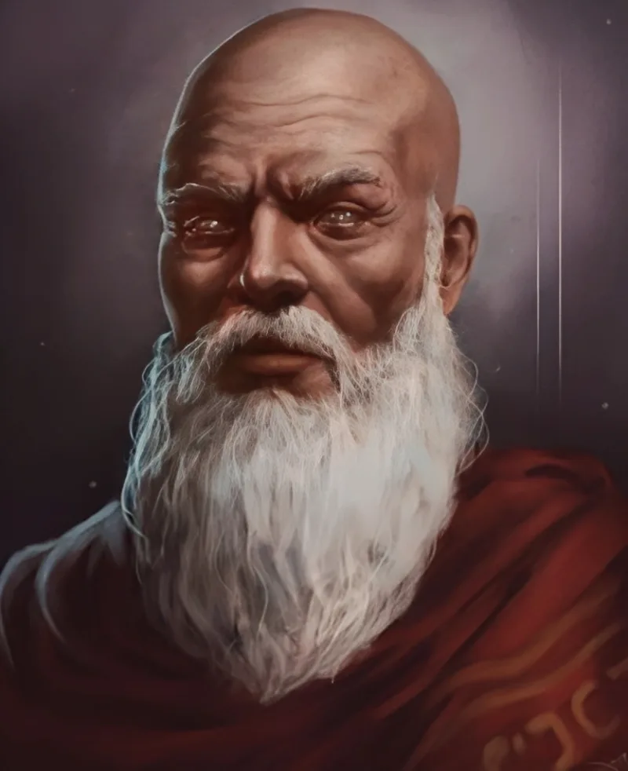

<dl>
<dt>Clan</dt><dd>Brujah</dd>
<dt>Generation</dt><dd>5th generation</dd>
<dt>Role</dt><dd>Brujah Primogen</dd>
<dt>City</dt><dd>Chicago</dd>
</dl>

Athenian philosopher. Embraced 423 BCE by [Menele](/npcs/menele/) after an all-night debate on the nature of power and obligation. Traveled to Carthage with his sire; spent decades in discourse with the Assamite vizier Mathos, mapping out the philosophical architecture of what they called "the great experiment." Was away from the city when it fell to Roman legions.

His fury at the Ventrue lasted centuries. He sailed to the New World, put down a Sabbat invasion in Boston through sheer tactical violence, and eventually settled in Chicago.

Founded the **Council of Scales** — a scholarly and legal-philosophy circle of Camarilla elders who examine the Traditions, advise Princes on the conduct of blood hunts, and aid the Inner Circle in selecting Justicars. A few dozen members across several clans. The Council is his anchor against the torpor that claims most Kindred of his age.

Teaching at the University of Chicago under rotating mortal identities. Runs a "Brujah School" — his term for a loose network of childer, students, and fellow travelers pursuing the Path of Entelechy. Envisions Chicago as "the new Carthage," a city where Kindred govern through reason rather than feudal decree. Actively opposes Chicago having a Prince, viewing the office as a corruption of what the Camarilla was supposed to be.

His renewed pedagogical drive — the School, the Path, the vision of an enlightened Brujah clan — originates from Menele's psychic communion. Critias does not know his sire is torpid beneath Chicago, subtly reshaping his priorities through the Bond. Every conviction Critias holds about the Brujah's future may be a sleeping Methuselah's dream wearing the mask of philosophy.

**Lineage:** Critias > Menele > Troile (Antediluvian).
