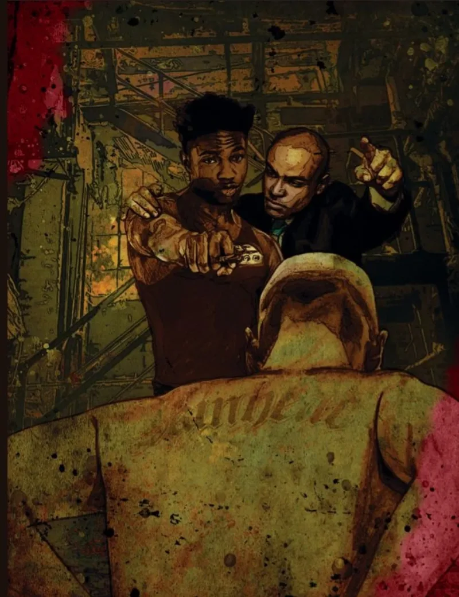

<dl>
<dt>Clan</dt><dd>Brujah</dd>
<dt>Generation</dt><dd>6th generation</dd>
<dt>Role</dt><dd>Childe of Critias</dd>
<dt>City</dt><dd>Chicago</dd>
</dl>

The boy was born in 1954 in Chicago. His mortal name is not recorded anywhere in Kindred archives. What is recorded: sometime in the late 1960s, Critias — Brujah Primogen, 5th generation, Embraced in ancient Greece, childe of Menele — found a fourteen-year-old street kid and, in what the source material describes as "a stupor," drained him and brought him back.

Critias did not stay. He did not explain what had happened. He did not teach the boy to feed, to hide, to manage the hunger that replaced the one he had known. He Embraced a child and walked away.

The timing matters. The late 1960s in Chicago: Martin Luther King Jr. assassinated in April 1968. The Democratic National Convention riots that August. The West Side burning. The National Guard on State Street. A city tearing itself apart over race and war and the failure of every institution that was supposed to hold. Into that chaos, Critias dropped a fourteen-year-old Brujah with 6th-generation blood and no sire to speak of.

Damien was never formally presented to the Prince. No Kindred authority acknowledged his Embrace. In Camarilla terms, he does not officially exist. He has survived since the late 1960s without a permanent haven, without a patron, without the social infrastructure that keeps most neonates alive through their first decade. He survived because his blood is old enough to make him one of the most physically dangerous Kindred in Chicago, and because he learned very quickly that the adults — mortal and Kindred alike — were not coming to help.

He has not come to terms with his need for blood. The hunger disgusts him. He overcompensates with ego, projecting an image of invulnerability that fools most Kindred who encounter him. Underneath the posturing is a decent kid with a highly developed sense of honor — the kind of honor that forms when no one else sets the rules for you.

His one genuine relationship is with Johann, a Malkavian elder. The attachment runs deeper than normal friendship or Blood Bond. Johann sees something in Damien that the boy cannot see in himself. The nature of that connection remains unexplained.

Belthazar, the Sheriff, persecutes Damien when he can find him. Belthazar does not know that the child he harasses carries 6th-generation vitae — Potence 5, Celerity 4, enough raw physical power to destroy most elders in direct combat. Damien staked the Sheriff during the events of Ashes to Ashes, an act that should have been impossible for a street waif. It was not impossible. It was easy.

The source material ends with a warning: "If there are to be any surprises in the Jyhad, they may come from this diminutive Brujah." A child abandoned by his sire, ignored by the Camarilla, persecuted by the Sheriff, carrying power that no one in Chicago properly understands. Critias's shame. Menele's grandchilde. Chicago's wild card.
