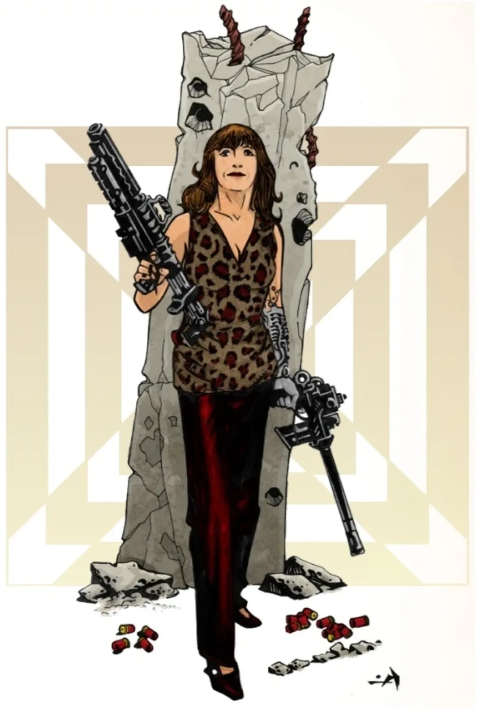

<dl>
<dt>Clan</dt><dd>Mage (Iteration X)</dd>
<dt>Role</dt><dd>Technocracy field director</dd>
<dt>City</dt><dd>Chicago</dd>
</dl>

Grew up on Chicago's South Side. Full scholarship to the University of Chicago in the 1970s. Recruited by Iteration X during graduate school. [Rose](/npcs/the-rose/) through the ranks by being smarter, more methodical, and more willing to work sixteen-hour days than anyone around her.

Founded Department 37 after identifying Chicago as a statistical outlier for unexplained deaths, disappearances, and anomalous medical data. The Center's cover is an art restoration laboratory near [the Art Institute](/locations/art-institute/). The basement contains things that would make the Art Institute's board of directors reconsider their lease agreement.

She has never personally killed a vampire. She has ordered the termination of fourteen.
