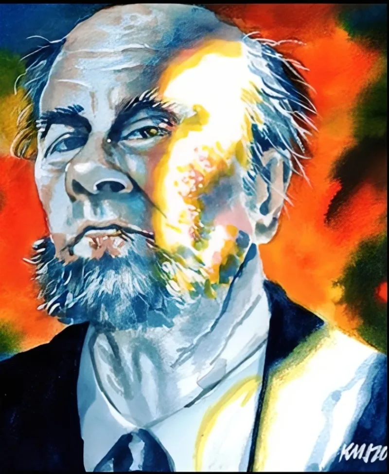

<dl>
<dt>Clan</dt><dd>Tremere</dd>
<dt>Generation</dt><dd>9th generation</dd>
<dt>Role</dt><dd>Vienna's Eyes</dd>
<dt>City</dt><dd>Milwaukee</dd>
</dl>

The man who became Dr. Mortius was born around 1516, likely somewhere in the German-speaking lands of the Holy Roman Empire -- the Tremere's traditional recruiting ground. The mid-sixteenth century was the age of Paracelsus, Agrippa, and John Dee: the last generation in which "natural philosophy" and "magic" occupied the same intellectual space without embarrassment. The universities at Heidelberg, Wittenberg, and Prague taught astronomy alongside astrology, chemistry alongside alchemy. A gifted student with the right inclinations could follow the rational thread of inquiry straight into the occult and consider himself more rigorous for it, not less.

Mortius did exactly this. The Tremere's foundational anxiety -- the thing that separates them from every other clan -- is that they were once mortal mages who seized vampirism through ritual rather than receiving it through the traditional Embrace. By the sixteenth century the other mortal magical traditions had largely vanished, absorbed or destroyed during the Tremere's long war against the Order of Hermes and the broader collapse of organized hedge magic. The Tremere Elders believed no mere mortal could independently rediscover the principles of true magic. Mortius proved them wrong. Working alone, through experiment and observation and what must have been extraordinary intellectual stubbornness, he replicated effects that the Tremere considered their exclusive province.

This made him simultaneously valuable and terrifying. A mortal who could do what only Tremere were supposed to do was either an asset to acquire or a threat to eliminate. They chose acquisition. Mesita, his sire, Embraced him in 1566 -- the year that saw the iconoclastic fury sweep the Low Countries and the Ottoman Empire reach its greatest territorial extent. Mortius was already old by the standards of the era, in his late forties or early fifties. The Embrace preserved him as he was: stooped, bearded, hunchbacked, with mottled skin. An old man's body housing an immortal's ambition.

He spent the next four centuries doing what the Tremere do: research, hierarchy, obedience. His Mentor (rated 4 in the source material) represents significant standing within the clan's internal power structure -- access to Vienna's inner circles, ritual libraries, and the political protection that comes with being useful to people who matter. Mortius is not a rebel. He is a company man with a laboratory. The Cult of the Enlightened serves as his research staff -- mortal acolytes who believe they are pursuing spiritual advancement and are in fact running experiments for a vampire who views them as disposable equipment.

The Marquette null zone drew him to Milwaukee. Marquette University was founded by Jesuits in 1881, built on land that held older significances. Beneath the campus, Native American totems are buried -- artifacts of a spiritual tradition that predates European contact by millennia. Something in that ground suppresses all supernatural power within a defined radius. Thaumaturgy fails. Other Disciplines fail. Vienna considers this Priority One, because a mechanism that negates supernatural power could theoretically negate Blood Bonds, and Blood Bonds are the architecture that holds the Tremere hierarchy together.

Mortius patrols the null zone's perimeter, testing boundaries, mapping the suppression field's edges, reporting back to Vienna through the clan's coded courier network. He shows visiting Kindred his magical gadgets -- a tube that functions like a telescope, trinkets that were impressive three centuries ago and are now redundant to technology. The demonstrations are a smokescreen. The real work is classified.
