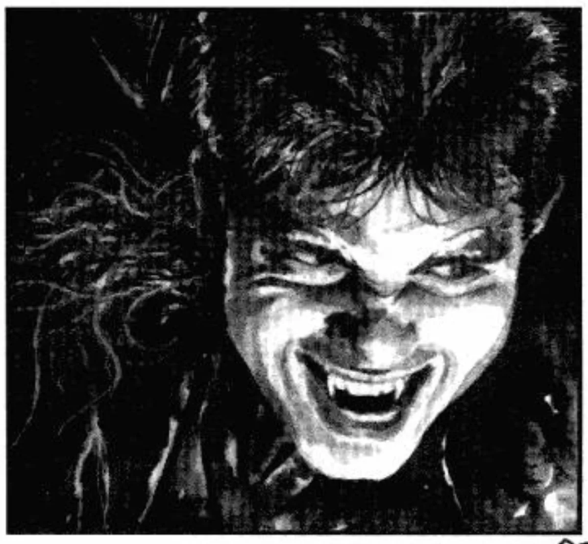

<dl>
<dt>Clan</dt><dd>Brujah</dd>
<dt>Generation</dt><dd>9th generation</dd>
<dt>Role</dt><dd>Brujah clan leader and Idealist</dd>
<dt>City</dt><dd>New Orleans</dd>
</dl>

California Brujah, Embraced 1853 by MacNeil. Came to New Orleans in 1951, took over clan leadership immediately by proving himself more capable than the previous agitator. When Doran was assassinated, Dutch made a run for the princeship — but his clan support collapsed before he could consolidate. He backed off and accepted clan leader as his ceiling, for now.

He watches [Christopher](/npcs/christopher/) because he sees something in the boy that he wants to cultivate. He doesn't know why [Jereaux](/npcs/jereaux-guilbeau/) arranged Christopher's Embrace specifically, which means he's missing a piece of the picture.
