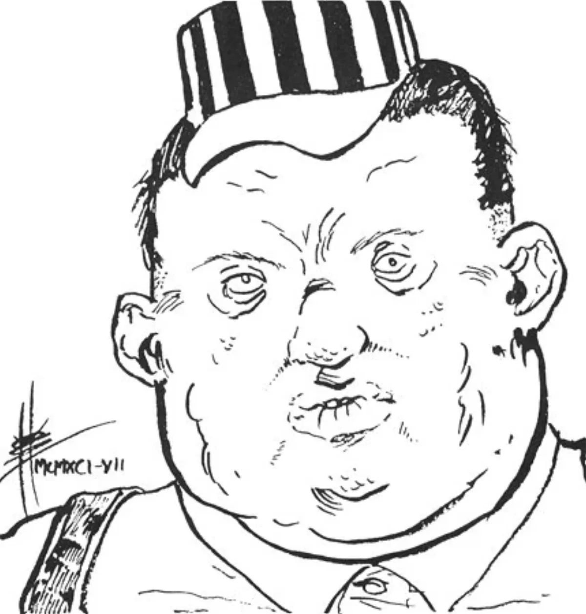

<dl>
<dt>Clan</dt><dd>Ventrue</dd>
<dt>Generation</dt><dd>8th generation</dd>
<dt>Role</dt><dd>Ventrue railroad baron / [Lodin](/npcs/lodin/)'s childe</dd>
<dt>City</dt><dd>Chicago</dd>
</dl>

Edgar Drummond was the son of an 1800s railroad tycoon who believed "the boy" was far too stupid to take over his enterprise. Edgar found this out only after the old man died, leaving him with a token amount of money and his two younger brothers with control of the railroad. Furious, Edgar started his own railroad, swearing it would soon gobble up the one his father had built. But Edgar's father had been a good judge of character, and in no time the railroad was in trouble and Edgar was almost penniless.

As Edgar prepared to go cap-in-hand to his brothers, he was approached by two bankers who offered him more than enough money to keep it operating in exchange for 51% of the stock and the right to name the vice-president. In no time, the company was prospering. The company's success attracted notice and caught [Lodin](/npcs/lodin/)'s eye. As Chicago was becoming the nation's most important rail hub, the Prince was looking for someone to take charge of the railroads — and as the owner of the fastest-growing railroad company in history, Edgar seemed ideal. Edgar nearly fainted at the offer of total control of every train, every station and every yard of rail in the city.

Ironically, it was Edgar's disappearance which revealed the falsity of his company's success. The ensuing investigation turned up a labyrinth of corruption, illegal stock manipulation and other abuses, and the company was shut down.

Edgar revels in his power. He runs Chicago's trains from command centers in the hearts of the city's train depots. His only pleasure is the exact scale model of the city's rail and subway networks which he maintains in his Haven.

Edgar's once-substantial power has been eroded by the growth of air and road travel, but he still considers the railroads to be the backbone of Chicago's commerce. He may fly into a rage if characters insist on telling him that rail travel is obsolete. He protects his empire with unmatched zeal, and feeds solely on bums, hobos and other "deadbeats" who dare trespass in his realm. [Lodin](/npcs/lodin/) often promises to allow Edgar to make a lieutenant one day but has continued to put off that time.

**Note:** Hates to be called "Edgar" and will fly into a rage if anyone refers to him as anything but Mr. Drummond — or Sir.
