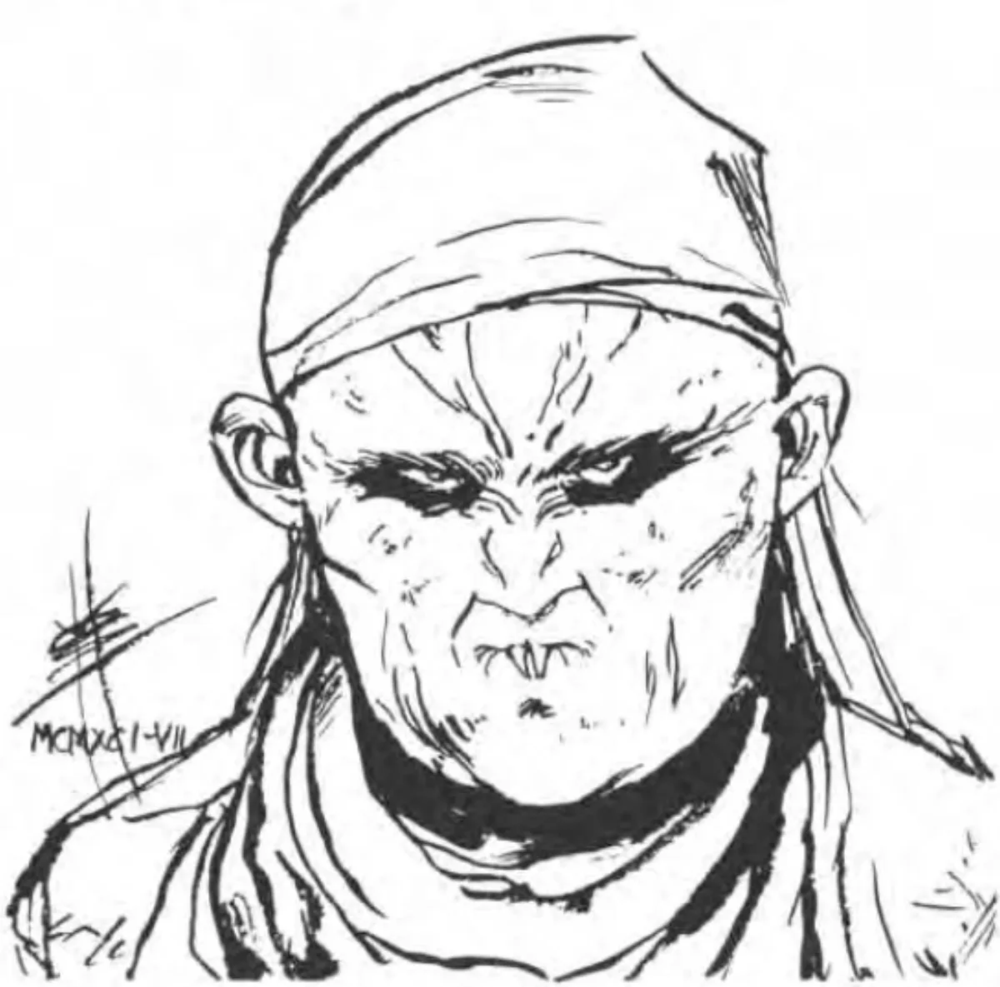

<dl>
<dt>Clan</dt><dd>Nosferatu</dd>
<dt>Generation</dt><dd>7th generation</dd>
<dt>Role</dt><dd>[Khalid](/npcs/khalid-al-rashid/)'s muscle / Nosferatu enforcer</dd>
<dt>City</dt><dd>Chicago</dd>
</dl>

Elzbieta immigrated to America in 1887 with her family, unmarried at the ripe old age of 27 despite (or perhaps because of) the fact that she could lift a year-old calf over her head by the time she was 16. Separated from her family in New York, she made her way with many other Polish immigrants to Chicago. There, she found work in a canning factory, handling crates of canned beef weighing as much as she did. Her goal was still to find a husband, and her continued failure was making her more and more bitter.

One night, while walking home late from work, she was attacked by [Annabelle](/npcs/annabelle-triabell/) Treabelle, who was out looking for a snack. Much to the surprise of both [Annabelle](/npcs/annabelle-triabell/) and [Khalid](/npcs/khalid-al-rashid/), who was secretly trailing the Toreador, the victim became the attacker and thrashed [Annabelle](/npcs/annabelle-triabell/) within an inch of her unlife. Elzbieta was about to call the police when [Khalid](/npcs/khalid-al-rashid/) made his appearance. He convinced the stocky immigrant to follow him -- more through her amazement at his horrendous appearance than by anything he said -- and the two went to his Haven, leaving the unconscious Annabelle to fend for herself. There, Khalid explained the nature of her attacker as well as his own, and invited her to join him in this state. Elzbieta, believing this deformed nobleman was the fantasy suitor she had long dreamed of, was more than happy to accept his offer.

During the past century the two have remained close, though Elzbieta quickly learned that Khalid's intentions did not include marriage. She keeps him well-informed about goings-on in the city, and provides him with valuable muscle when it is needed. She has remained hostile toward Annabelle, though it is due more to jealousy of the Toreador's beauty and finery than the assault. Khalid is aware of this hostility, and does much to keep it in check. Still, nothing gives Elzbieta more pleasure than interfering with Annabelle's affairs.

**Image:** A very large female Nosferatu, though her gender is not always obvious.

**Roleplaying Hints:** Try to be friendly, but she uses her Intimidation without even being aware of it. Has a thick, guttural Polish accent.

**Haven:** The deserted meat-packing factory in which she once worked, near the stockyards in the south of Chicago.

**Secrets:** A-
