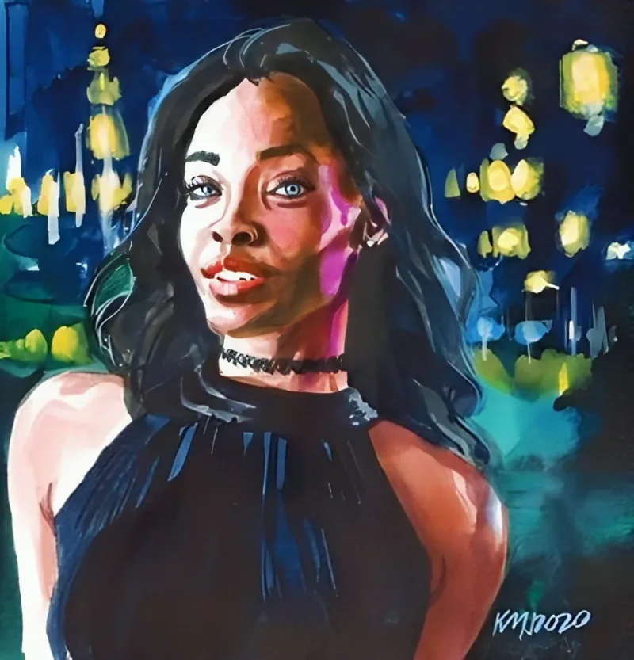

<dl>
<dt>Clan</dt><dd>Brujah</dd>
<dt>Generation</dt><dd>9th generation</dd>
<dt>Role</dt><dd>Hidden Childe</dd>
<dt>City</dt><dd>Gary</dd>
</dl>

Grew up in the Pulaski neighborhood of Gary. Moderate means, public school, competed in sports. Her older brother Gregory Stephens became a Gary police officer and later commissioner. She became a juvenile delinquent.

Overdosed. Left Gary for Chicago to try modeling. The modeling did not work. What came next was worse.

Born 1967, Embraced 1986 by Juggler. 9th generation. Spent a decade in Chicago as a Brujah Anarch before the main campaign timeline. Knows the Chicago Anarch network from the inside — the safehouses, the grudges, the people who disappeared and the people who pretended not to notice.
