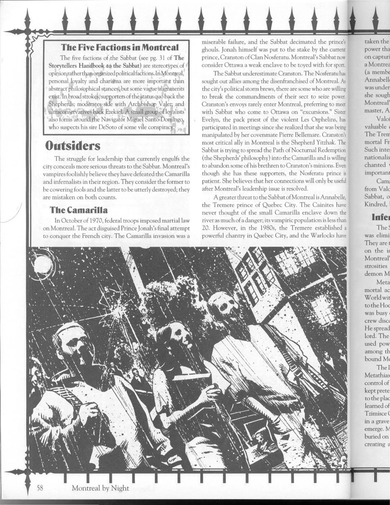

<dl>
<dt>Clan</dt><dd>Ventrue antitribu</dd>
<dt>Generation</dt><dd>12th generation</dd>
<dt>Role</dt><dd>Pack Priest, Les Orphelins</dd>
<dt>City</dt><dd>Montreal</dd>
</dl>

[Evelyn](/npcs/evelyn-stephens/) Marlowe came to Montreal in 1994 to attend to the affairs of her murdered aunt and grandmother and to find her missing brother. When the police (infamous for their lack of zeal in investigating crimes in the black community) told her that there were no suspects in the brutal double-murder and no leads to finding her missing brother, [Evelyn](/npcs/evelyn-stephens/) investigated by herself. She found evidence of hidden inhabitants at the Douglas Hospital (Les Miserables' lair) and made a journey to the Sabbat bar, [Angel's Fall](/locations/angels-fall/). She survived through a combination of quick thinking and the judicious use of firearms.

As word of [Evelyn](/npcs/evelyn-stephens/)'s exploits filtered down to the communal haven, [Pierre](/npcs/pierre-bellemare/) argued strategically that she should be destroyed because she thought she was "as good as the Sabbat." This motivated the patriotic [Marie-Helene](/npcs/marie-helene-dutoit/) to give [Evelyn](/npcs/evelyn-stephens/) the chance to defend herself against the accusation. [Evelyn](/npcs/evelyn-stephens/) was Embraced by [Marie-Helene](/npcs/marie-helene-dutoit/). [Pierre](/npcs/pierre-bellemare/) awaited above her grave with her Embraced brother Robert. [Pierre](/npcs/pierre-bellemare/) told Evelyn that Robert had been saved from a mad vampire, but was difficult to control. He claimed that he needed her help to calm and train her brother, and he welcomed her into his pack.

Evelyn followed the Path of Power and the Inner Voice, and drifted from her sire because of language issues. [Pierre](/npcs/pierre-bellemare/) was more than happy to allow Evelyn to become pack priest, but only after she destroyed Philippe La Peste, a childe of Pierre's who exhibited too many symptoms of the diseases within his blood. As for Robert, he was destroyed during a particularly violent pack outing. Evelyn suspects that Robert was eliminated deliberately.

Evelyn realizes that Pierre manipulated her. Indeed, she is convinced that her pack and perhaps all the Sabbat in the city are somehow corrupt. Unable to trust her own kind, Evelyn has accepted two invitations to meet Camarilla vampires from Ottawa, hoping to find a way to lash out at Pierre. Evelyn is still loyal to the Sabbat itself, but fears that she may be forced to join the Camarilla to escape [Bellemare](/npcs/pierre-bellemare/).

**Image:** Evelyn wears a long black trench coat and shaves her head. Her chocolate-colored eyes glow in the moonlight.

**Secrets:** Evelyn is aware that her pack is more than it appears and that Cranston of Ottawa has other sympathizers in Montreal. She has yet to discover who they are.
