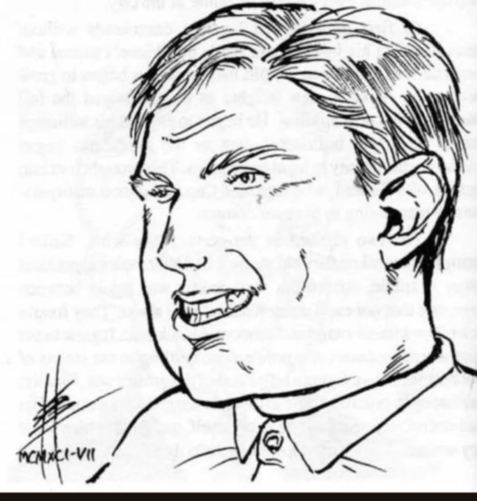

<dl>
<dt>Clan</dt><dd>Ventrue</dd>
<dt>Generation</dt><dd>9th generation</dd>
<dt>Role</dt><dd>[Capone](/npcs/capone/)'s enforcer / Irish mob boss</dd>
<dt>City</dt><dd>Chicago</dd>
</dl>

Born in the slums of Southern Chicago, Frank Gaughan learned to fight as soon as he learned what it meant to be a Catholic surrounded by Protestants. He ran with several street gangs during the late 1930s but was drafted into the army for World War II before he could make his mark on the streets. He became a sergeant and proved himself a natural leader of men.

After the war he returned to Chicago and tried his hand at legitimate work for several years. He soon tired of that life, finding the term "No Irish Need Apply" still a far too common experience. He began to revive the old Irish mob to break the Mafia's stranglehold on organized crime. Within a year he and his allies had become a significant threat to the mob's control of gambling and prostitution, and had even begun to muscle in on some local unions.

Before he could bring his plans to fruition, he was visited by Al [Capone](/npcs/capone/). Despite their different nationalities, Gaughan had always admired the legendary mob boss. When [Capone](/npcs/capone/) asked Gaughan to join him in really running the city, the Irishman leapt at the chance. At first he served [Capone](/npcs/capone/) as a retainer, taking control of a significant proportion of Chicago's underworld. However, he quickly saw he had been placed in a no-win situation — allowed to control certain areas but unable to do more than the Vampires let him. He began preparations to destroy the Kindred who ruled the city. Just days before his men were to act, [Capone](/npcs/capone/) paid him another visit and told him the Prince would now permit Gaughan's Embrace. Believing this would give him power beyond belief, Gaughan called off his plans and became a Vampire.

Since his transformation in 1963 [OCR unclear — stat block says Embrace 1952], Gaughan has enjoyed using his new-found powers and manipulating mortals. Most of his old gang members have used this new connection to rise high in both business and government. Since the Anarch rising in the late '80s — which he played a strong role in suppressing — he has begun to dream about becoming Prince of Chicago. [Capone](/npcs/capone/) has been suspicious of him for some time, but has found Gaughan's leadership and organizational abilities too valuable to do without. He now keeps a close eye on Gaughan, a fact of which Gaughan is well aware.

Gaughan feeds on Italian men — a measure of revenge against his Sire.
