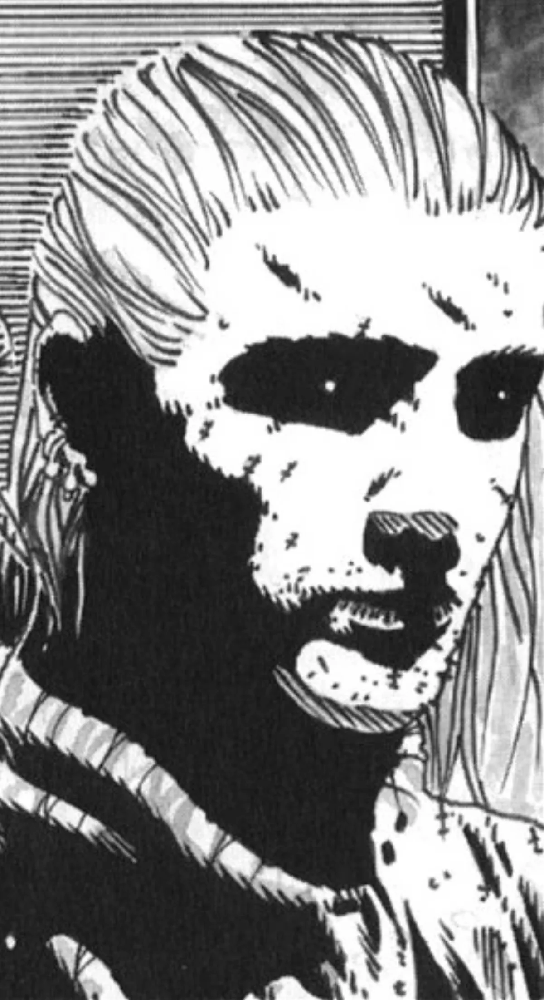

<dl>
<dt>Clan</dt><dd>Country Gangrel antitribu</dd>
<dt>Generation</dt><dd>8th generation</dd>
<dt>Role</dt><dd>Former Shepherd leader, obsessive researcher of [Mount Royal](/locations/mount-royal/)</dd>
<dt>City</dt><dd>Montreal</dd>
</dl>

When the Catholic church dissolved the Order of Jesuits for political reasons at the end of the 18th century, the missionary Marc Arsenault was left isolated in a native settlement of the Ottawa Valley. When returning to Montreal to receive instructions from the church officials and to have a meeting with Soeur Jeanne (the "nun" with whom he had been corresponding), Arsenault was attacked and Embraced by a nomadic pack of Country Gangrel. Turned over to Jeanne, he joined the Shepherds.

Frere Marc never wavered from his desire to understand and convert the natives of Quebec, and he was intrigued by stories of natives who never survived the Embrace. He has Embraced hundreds of natives in the area over the centuries and none have survived for more than a night. Marc is convinced that the demonic force that infests [Mount Royal](/locations/mount-royal/) is the source of these killings and has done all he can to uncover its mysteries. When his Divine Tide ebbs, Frere Marc's obsession becomes savage, and he resorts to harsh methods. He spends long nights torturing the enigmatic Librarian [Jacob the Glitch](/npcs/jacob-the-glitch/) and flays natives to understand the process of their death. He also "borrows" the preserved heart of his friend Brother Andre from the oratory and performs rituals on it.

Frere Marc served as leader of the Shepherds from 1951 to the trial of [Sangris](/npcs/sangris/) (some of his fellows blame his obsession with the mountain for the coven's troubles). The revelation that [Sangris](/npcs/sangris/) was an infernalist drove Marc from power and made it difficult for him to remain at the oratory. He now spends most of his time focused on his obsession, leaving coven affairs to Yitzhak and [Alfred](/npcs/alfred-benezri/).

**Image:** Rugged and worn, Marc bears the scars of the road he has traveled. He stands 5'7" tall, keeps his hair long, and wears simple travel attire.

**Secrets:** Frere Marc probably understands the most about [Mount Royal](/locations/mount-royal/). He knows that the demon trapped in the mountain is a fiend of disease and that it has access to feral creatures. He suspects that the monstrosity may not have been purged with the destruction of [Sangris](/npcs/sangris/).
