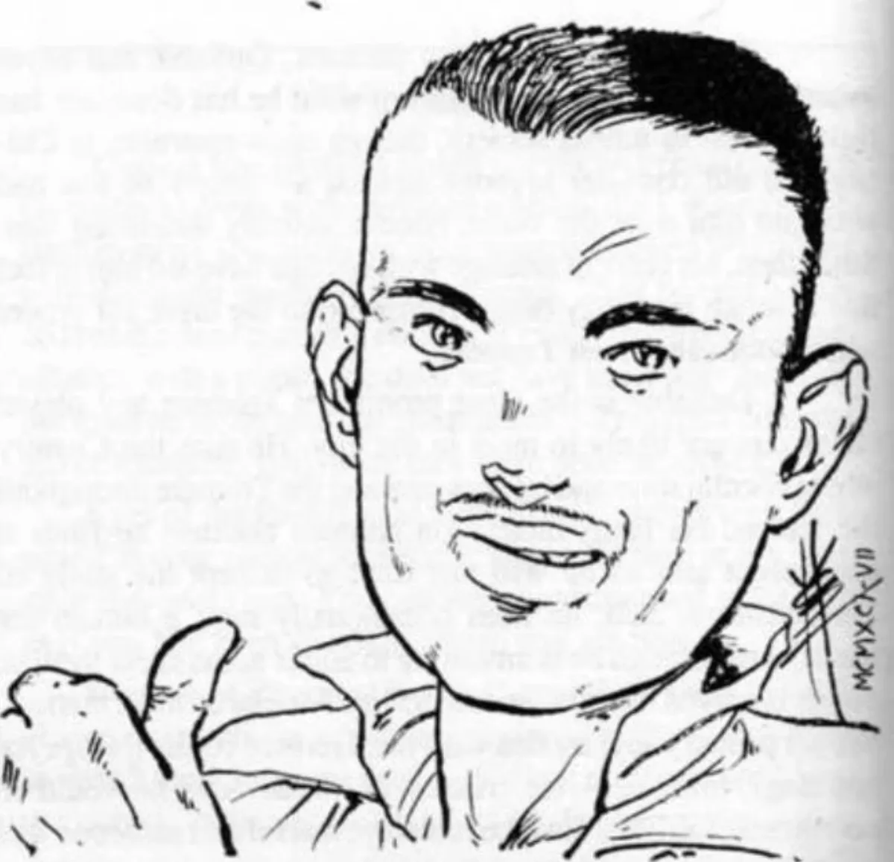

<dl>
<dt>Clan</dt><dd>Tremere</dd>
<dt>Generation</dt><dd>8th generation</dd>
<dt>Role</dt><dd>Tremere musician / Baby Chorus co-founder</dd>
<dt>City</dt><dd>Chicago</dd>
</dl>

Garwood Marshall was one of the numerous fine Black jazz musicians who, just prior to World War II, found themselves squeezed out of the better-paying gigs by the rising number of white bands. A very skilled horn and saxophone player and a capable singer, Garwood was despairing of ever earning the recognition he felt he deserved when [DuSable](/npcs/abraham-dusable/) entered the picture.

[DuSable](/npcs/abraham-dusable/) was quite taken with the angry young man, and for a short time near the end of the war, ran a jazz club primarily so Garwood could have a place to play. At the end of the war, Garwood was still unable to break into the big time and his anger was rising. DuSable, feeling that the time was ripe, approached [Lodin](/npcs/lodin/) and was given approval to make Garwood his childe. He explained the situation to the musician, who was completely fascinated by the idea. Garwood asked for time to think it over, but was already hooked. By the end of that week, he was a Vampire.

Much to DuSable's dismay, Garwood has shown little inclination toward the pursuit of power which so marks the Tremere. His anger at not being recognized while mortal came from the fact that he knew he really was good, not out of a need for audiences to admire him. Since becoming one of the Undead, he has spent most of his time trying to perfect his musical skills. During the time he spent in Vienna being Blood Bound to the clan Elders, he spent every night in the Staatsoper Opera House, watching the Vienna Philharmonic practice and perform.

As the years passed, even Garwood began to tire of music. He found little of interest in rock 'n' roll, tired of the jazz scene, and saw little hope for classical music. Then came punk. Leery at first at what he considered barely music, Garwood was soon swept up in the raw passion and energy. He first played with a punk band in 1979 and was one of the founders of Baby Chorus, a band he thought up after his first meeting with [Kathy Glens](/npcs/kathy-glens/) at one of Chicago's early punk clubs. His fraternization with Brujah, Toreadors and a Malkavian has not gone unnoticed by the powers-that-be in the Tremere, and he is currently under suspicion.

Garwood knows this, and is not willing to do anything else which might disrupt his standing in the clan or force him to lose the band.
