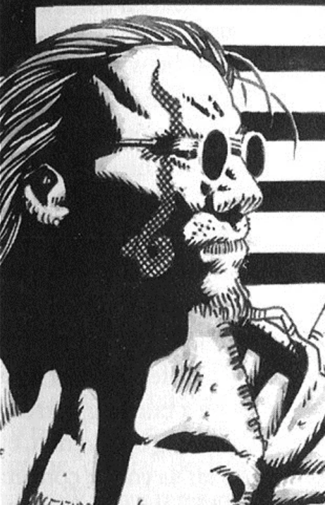

<dl>
<dt>Clan</dt><dd>Ravnos antitribu</dd>
<dt>Generation</dt><dd>10th generation</dd>
<dt>Role</dt><dd>Enforcer, Lost Angels</dd>
<dt>City</dt><dd>Montreal</dd>
</dl>

Gharston lived and died in L.A. He left home when he was 15 and made his way to Los Angeles to start a better life. Gharston tried everything, but ultimately found himself out of a job and worse off than when he started. By the time he was 20, his hope had been replaced by nihilism. He found his only outlets in violence and crime, and eventually made a living as a hit man. After a deal went bad, he met his end in a back alley off Sunset Boulevard. Had it not been for his future sire's close proximity, Roland would have become another statistic.

Keller, a member of the Lost Angels, Embraced Gharston because he needed help escaping an anarch gang that was hunting him. Keller was caught and destroyed; Gharston barely escaped by using his newly discovered powers. After the Lost Angels found the ashen remains of Keller, Gharston spent the following nights stalking the gang to learn as much as he could about it. He eventually approached [Valez](/npcs/carolina-valez/) and explained what had happened to his sire. She allowed him to join the Lost Angels and to undergo the Creation Rites.

Gharston has been a faithful member of the Sabbat and has become the enforcer of the Lost Angels. He spends most of his nights wandering around Montreal, keeping his ears open and noting what transpires. To the annoyance of the other covens and packs, Gharston always seems to turn up at the most inopportune moments.

**Image:** Gharston's face is rugged; he has closely cropped dirty-blond hair and a goatee. He wears wire-rimmed glasses (a relic from his mortal life), jeans and a leather trench coat in which he carries two 9-mm. pistols loaded with silver bullets. He has a tattoo of a spiral dragon on his left cheek.

**Secrets:** Gharston has little to go on, but suspects that there is more to [Pierre Bellemare](/npcs/pierre-bellemare/) than meets the eye.
