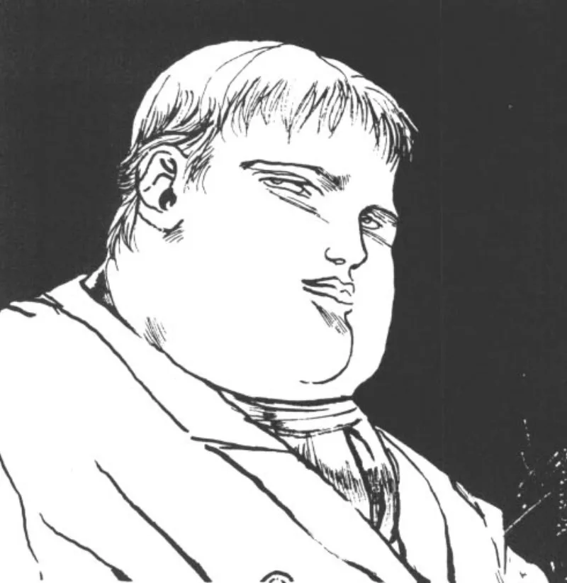

<dl>
<dt>Clan</dt><dd>Ventrue</dd>
<dt>Generation</dt><dd>8th generation</dd>
<dt>Role</dt><dd>Milwaukee's Caesar</dd>
<dt>City</dt><dd>Milwaukee</dd>
</dl>

Gracis Nostinus was a Roman citizen in the early fifth century. Educated, literate in six languages, and by the standards of the late Western Empire, a man of consequence. Rome was dying around him. The legions were withdrawing from the frontiers. The administrative machinery that had governed half the known world for centuries was seizing up province by province. Gracis watched the collapse from inside the system, which is a specific kind of education in institutional failure.

In 412 AD, the Roman general Marius Embraced him. Marius also Embraced a captured Danish barbarian named [Hrothulf](/npcs/hrothulf/), taken on a battlefield at the age of eighteen. The two childer were meant to serve different functions: Gracis as the administrator, [Hrothulf](/npcs/hrothulf/) as the weapon. Marius enjoyed the contrast. He spent fifty years taunting [Hrothulf](/npcs/hrothulf/) for his illiteracy, his barbarism, his fundamental inadequacy measured against Roman civilization. Gracis was the implicit comparison. The civilized one. The correct choice.

The arrangement ended in violence. [Hrothulf](/npcs/hrothulf/) snapped. He threw a knife into Marius's shoulder, broke his sire's back with a torch, and committed diablerie while Marius begged for his life. Gracis grabbed a gladius and attacked. He slipped in Marius's blood, and Hrothulf stabbed him through the stomach. Hrothulf could have finished him. He chose not to. That mercy became the foundation of a vendetta that has now lasted sixteen centuries.

Gracis swore to avenge Marius and destroy Hrothulf. The oath has outlasted Rome, outlasted the medieval period, outlasted the Renaissance, the Reformation, the Enlightenment, and the Industrial Revolution. It has become the organizing principle of his existence. Not grief for Marius, who was a cruel master. Not justice. The vendetta sustains him because without it he is a soft, pink-looking man with a chubby face and thinning blond hair who stands five feet tall and has no war to fight.

He arrived in the Milwaukee area in 1834, settling in Kilbourntown, the western half of the settlement that would become Milwaukee. The city was then two rival towns separated by the Milwaukee River: Byron Kilbourn's Kilbourntown on the west bank and Solomon Juneau's Juneautown on the east. The real-world rivalry between these settlements was bitter enough to produce the Bridge War of 1845, when partisans destroyed bridges connecting the two sides. Hrothulf had established himself in Juneautown years earlier. The geographic split mirrored the political one. Two Ventrue elders, one river, and a feud older than the city by fourteen hundred years.

A Nosferatu Justicar eventually forced a ceasefire after a protracted war of assassins between the two camps. The violence went underground. Gracis pivoted to the Primogen Council, where he now controls three of the six votes and can force a stalemate on any issue. He cannot achieve a majority without the swing vote, but he can prevent Hrothulf from achieving anything at all.

His Nature is Child. Beneath the Roman gravitas and the two millennia of accumulated political craft, Gracis wants to be the one who saves the city. He wants Milwaukee to be his Rome, the province he governs correctly, the thing he protects from the barbarians at the gate. That the barbarian is his own blood-brother, and that his obsession with destroying Hrothulf is the thing most likely to destroy Milwaukee, is a contradiction he cannot see.
