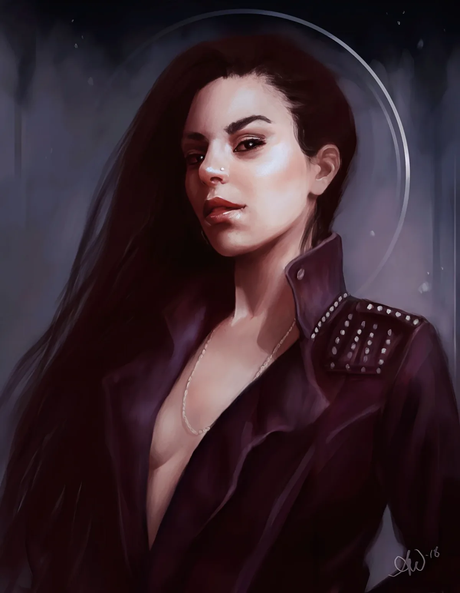

<dl>
<dt>Clan</dt><dd>Toreador</dd>
<dt>Generation</dt><dd>4th generation (via diablerie of 3rd-gen sire)</dd>
<dt>Role</dt><dd>Toreador Methuselah / hidden power</dd>
<dt>City</dt><dd>Chicago</dd>
<dt>Embrace</dt><dd>1233 B.C. (born 1207 B.C.)</dd>
</dl>

Toreador Methuselah. Childe of Minos. 4th generation via diablerie. Three thousand two hundred years old. Even just coming out of torpor, one of the most beautiful creatures in existence. She still has dirt in her hair. Goes by the name [Portia](/npcs/portia/). **Conscience 0.** Willpower 10. Humanity 5.

Dominate 8 (without eye contact — only needs to know the target's location; can "lock out" other Dominations by adding 3 to target's Willpower against new commands; can Dominate multiple people simultaneously), Auspex 7 (sense over vast area as if looking from high above; locate anyone she knows), Celerity 5, Presence 5, Fortitude 5, Obfuscate 5, Potence 4, Thaumaturgy 3. Manipulation 8. Appearance 5 (8 when fully recovered).

Weakened from torpor. Stats in parentheses are her full recovered values — probably within a few years: Str 5(7), Dex 6(8), Sta 4(6), Cha 6(8), Per 5(7), App 5(8).

## The Princess of Argos (~1207-1233 B.C.)

Around 1200 B.C., Helena was the most beautiful of Achaean women. Favorite daughter of the king of the coastal city of Argos. Then Minos came to visit — an ancient, horribly ugly Kindred who fell in love with her immediately. When Helena begged her father to drive the creature out, she watched his eyes glaze over as he told her she was going to marry the old man. She fled the palace with a single handmaiden.

On the shore of the Aegean she met Prince [Prias](/npcs/prias/) — the most beautiful man she had ever seen. He convinced her to flee to his city in Asia Minor, where his family was one of the most noble houses in that part of the world. For ten years they lived happily.

Then Minos tracked them down. Her horrible suspicions that he was not human proved correct. He tore through [Prias](/npcs/prias/)'s ancestral home like mice against an elephant, hurled [Prias](/npcs/prias/) through a wall, and seized Helena.

## The Embrace and the Amaranth

Minos chained her to her father's bed. He fed from her each night — taking only slightly more blood than her body could replace, prolonging her agony over months. On the final night he drained the last of her blood, replaced it with just enough of his own, and left her locked in a room with her aged father. He waited outside for the screams.

When her first Frenzy subsided, Helena realized she had killed her own father.

Her spirit broken, she allowed the marriage. She placed the crown on Minos's head herself. Together they ruled Argos. Helena came to accept — and eventually enjoy — her new form. But she hated sharing her pleasure with Minos.

She traveled to Delphi. The oracle told her that drinking her sire's blood could both destroy her tormentor and make her more powerful — but warned that it would cost what was left of her soul.

For thirteen years she waited. Then [Prias](/npcs/prias/) returned. His relatives had taken him to Egypt to recuperate. He had searched Minos's old haunts in Crete and Rhodes before finding them in Argos. With a force of soldiers, he attacked at dawn. He drove a wooden spear deep into Minos's breast. As the ancient lay paralyzed, Helena sprang for her sire's throat. She drank deeply. She rose from the drained and destroyed Elder with blood streaming down her smiling face.

This was the Amaranth — diablerie of one's own sire. It elevated her to 4th generation.

## [Prias](/npcs/prias/) — Three Thousand Years

[Prias](/npcs/prias/) refused the Embrace absolutely. He would never become one of the horrors who fed on the blood of the living. Helena offered an alternative: drink her blood, gain immortal life and extraordinary powers. He accepted. For the next three thousand years they lived together — Kindred and ghoul. He is an extremely beautiful blond young man with deep blue eyes and a dark, rich tan. Prefers robes.

Helena first abused the Blood Bond during the Carthage period, forcing [Prias](/npcs/prias/) to hunt her enemies during the day. He believed their love had grown deeper. Helena knew the truth.

After three millennia of feeding on 4th-generation blood, Prias reads as a Vampire to Auspex. Chicago's Tremere believe him to be an Inconnu. He possesses a silver sword made by Carthaginian vampire craftsmen — its wounds cannot be healed by Kindred except by mixing another vampire's blood with their own and pressing it to the wound.

When Helena fell into torpor at Fort Dearborn, Prias stopped feeding on her blood to ensure she had enough for healing. He began killing other Kindred and taking their blood instead. As he did, he felt the Blood Bond — a bond he never knew he had — slipping away. Amazed at having free will for the first time in two thousand years, he pledged never again to drink her blood.

**Helena does not know her control of Prias has broken.** He still loves her. He does most of what she orders. But he is no longer bound. He is afraid his powers may leave him without her blood. He has begun to think about killing the woman who once gave his life meaning.

## Carthage and the Betrayal

Helena and Prias reached Carthage just as the Brujah were raising it to its greatest glory. At first they fought for Carthage. Then they saw who the winners would be. They fled to Rome and gave the Ventrue the intelligence they needed to destroy the city. In exchange, Helena received the fief of Pompeii.

[Menele](/npcs/menele/) discovered the betrayal and swore vengeance. He tracked her to Pompeii and summoned a spirit of fire. The eruption buried the city. Helena survived through Prias's aid. They fled to Egypt.

## The Conquistadors

For 1,300 years, Helena and [Menele](/npcs/menele/) fought across Eurasia. In 1415, near Agincourt, Helena and Prias dealt [Menele](/npcs/menele/) a near-fatal blow. He escaped — faked his death and crossed the Atlantic.

When Helena's Auspex detected [Menele](/npcs/menele/) far across the sea, she moved the Spanish Empire to send explorers westward. She joined the expedition of Hernan Cortez, along with Prias and several female progeny she had made.

In the Aztec capital, Helena encountered something beneath the great pyramid — a sleeping entity of such power that she fled upon sensing it. She left behind a childe, **Marie Galbraith**, and another follower, **Melinda**, who would eventually become Sabbat Cardinal of Mexico City. Both hate her. The rumors that Helena has been spotted in Mexico City continue.

A mage named **Motolina** traveled with Helena during the conquest. He was Blood Bonded to her — addicted to her vitae and used as her "pet mage." The Bond eventually broke. Motolina reshaped himself into a female form that is the spitting image of Helena. He still lives in the Mexico City area. He hates her.

Helena destroyed the Maya with other tools. Then allied with Pizarro to destroy the Inca. [Menele](/npcs/menele/) barely escaped and fled north through the Pueblos. For centuries Helena tracked him across North America.

## The Feeding

After the climactic battle in Spain and a century of searching, Helena discovered a new threat. She no longer gained sustenance from the blood of mortals. Only the vitae of Kindred could satisfy her needs. Soon this was limited to female Kindred, though she found their blood nourished her far more than any mortal blood ever had.

## Fort Dearborn (1832)

Helena allied with the United States military. [Menele](/npcs/menele/) with Chief Black Hawk. The air turned red with the vast quantities of blood they used. Helena dug her claws into [Menele](/npcs/menele/)'s ribs. Menele drove his skull into her forehead. Both were thrown to the ground. Prias drove a burning stake into Menele's neck.

Both Methuselahs fell into torpor. Prias carried Helena to a place of safety under the fort — deep in the dark earth at the bottom of a well, which he bricked up.

## The Sleeping War — Chicago

Even in torpor, Helena used Auspex and Dominate to fight. She controlled soldiers in the fort, then settlers, then civilians as Chicago grew. When she discovered Menele had already begun work in the city and controlled the Prince, she found a new pawn — [Lodin](/npcs/lodin/). She caused Chicago's Malkavians to light the Great Fire of 1871, destroying many of Menele's pieces. [Lodin](/npcs/lodin/) defeated Prince [Maxwell](/npcs/maxwell/) and took praxis. Helena's puppet sat on Chicago's throne.

## The [Succubus Club](/locations/succubus-club/)

As Helena began to shrug off torpor, she telepathically contacted Prias. He found [Brennon Thornhill](/npcs/brennon-thornhill/) — a rich drug dealer — and used Domination to convince him to open a nightclub directly above her resting place. May 23, 1982: the [Succubus Club](/locations/succubus-club/) opened. Construction workers who excavated the earth above Helena were Dominated by Maria, then killed.

Helena clawed her way through the earth, sucking what little vitae she could from worms and maggots. Met at the top by Maria — her own childe, 5th generation, the most powerful Toreador in Chicago for decades. Helena promptly slew her. First feeding upon waking. No hesitation.

She collapsed back into torpor for another month. When she came to her senses, Prias stood next to her. She entered the [Succubus Club](/locations/succubus-club/) for the first time.

The haven beneath the club is defended in depth: [Kevin Jackson](/npcs/kevin-jackson/)'s gang members near the entrance (automatics, memory-wiped), a secret door requiring Perception + Alertness of 9, a ghoul scorpion named **Hecabe** fed on 4th-gen blood since Pompeii (grown to the size of a house cat, poison causes aggravated wounds to Kindred), a six-inch steel vault door, a decoy vial of drugged blood, a pressure-plate scythe trap, electrified crawlspace, and the well itself.

## The [Portia](/npcs/portia/) Identity

Helena masquerades as a recently arrived neonate from the Greek isles. Timid and distant. Wary of automobiles. Shocked by television. Bewildered by mortals. Smart enough to avoid archaic jargon — conversations with club-goers keep her current. She reminds herself of the nights when she ruled in Pompeii.

No Kindred in Chicago knows Maria is dead. All Toreador are very interested in what happened to her, and would pay well for information.

## The Network

**[Lodin](/npcs/lodin/)** — puppet-Prince of Chicago. Does her bidding without realizing it.

**Prias** — her ghoul-lover for three millennia. All attributes at 5. Melee 7. He possesses the Carthaginian silver sword. He operates independently, cultivating allies. He has killed a number of Chicago's Kindred on both sides of the Jyhad. He still has some of their blood in storage.

**[Tyler](/npcs/tyler/) / Patricia** — born 1352, Embraced 1381 by Robin Leeland (7th gen Brujah). 6th generation after diablerizing a Ventrue Elder in Spain — the event that triggered the Anarch Revolt. Helena sensed her in Cartagena and "immediately recognized her potential as an assassin of Vampires." Thirty years of manipulation, then Blood Bond. Called to Chicago in the early 1900s. Receives orders through telepathy. Ordered to stay away from the [Succubus Club](/locations/succubus-club/) so no one recognizes her. During the Council Wars, [Tyler](/npcs/tyler/) slew a 6th-generation descendant of [Critias](/npcs/critias/) who refused to end his support of [Maldavis](/npcs/maldavis/).

**[Tyler](/npcs/tyler/) → [Juggler](/npcs/juggler/)** — Helena Blood-Bonded [Tyler](/npcs/tyler/) to [Juggler](/npcs/juggler/), making [Juggler](/npcs/juggler/) believe the Bond was his own idea. She developed [Juggler](/npcs/juggler/)'s potential as an Anarch leader.

**[Nicolai](/npcs/nicolai/)** — Tremere Regent. Thoroughly controlled by Helena. The only reason he has not stood for Clan Justicar.

**[Brennon Thornhill](/npcs/brennon-thornhill/)** — Ventrue, [Succubus Club](/locations/succubus-club/) owner. Helena led [Lodin](/npcs/lodin/) to Embrace him. Unconsciously serves as her main protector. Beginning to suspect his decisions were not his own.

**[Annabelle Triabell](/npcs/annabelle-triabell/)** — Helena believes she controls [Annabelle](/npcs/annabelle-triabell/) through Domination, having taken her during the Council Wars. Central to Helena's understanding of the power structure.

**Maria** — 5th gen childe. Slain upon Helena's awakening. No one knows she is dead.

**Francois Villon** — 5th gen childe. Prince of Paris. Embraced 1240 during Helena's search for Menele through Europe. He learned strong rule and the necessity of strict order from his sire.

**Marie Galbraith** — childe, left behind in Mexico during the conquest. Wooed by the sleeping entity beneath the pyramid.

**Melinda** — Sabbat Cardinal of Mexico City. Came with Helena and the Conquistadors. Abandoned. Joined the Sabbat to break the Blood Bond. Now serves the entity beneath the pyramid.

**Conscience 0.** Four thousand years burned out all empathy. She does not feel guilt, remorse, or hesitation.

**Nature:** Plotter. **Demeanor:** Bon Vivant.

**Lineage:** Helena → Minos (3rd gen, destroyed via Amaranth) → unknown Toreador Antediluvian. Downward: Helena → Maria (5th, destroyed) → [Annabelle](/npcs/annabelle-triabell/) (6th) → [Sharon](/npcs/sharon-payne/)/[Michael](/npcs/michael/) [Payne](/npcs/sharon-payne/) (8th/9th). Helena → Francois Villon (5th, Prince of Paris). Helena → Marie Galbraith (5th, Mexico).
