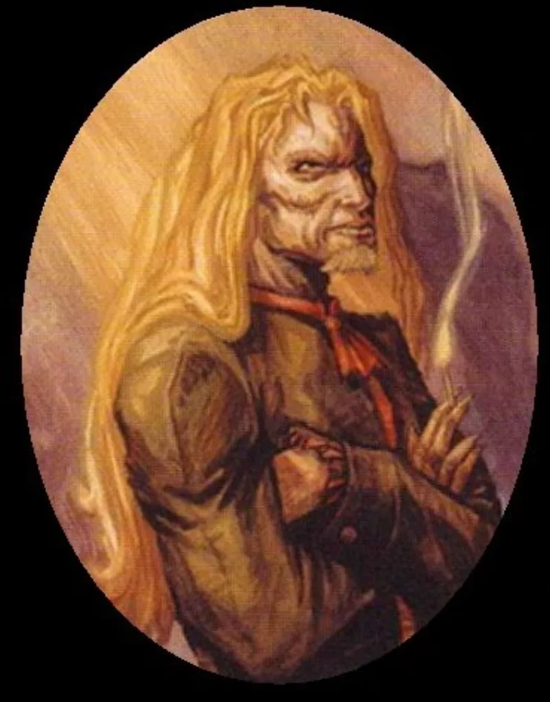

<dl>
<dt>Clan</dt><dd>Ventrue</dd>
<dt>Generation</dt><dd>7th generation</dd>
<dt>Role</dt><dd>Norse Elder</dd>
<dt>City</dt><dd>Milwaukee</dd>
</dl>

Hrothulf was born Danish, in the late fourth century, during the period when Rome still held Britain and the Germanic tribes existed as both threat and labor pool along the Empire's northern frontiers. He grew up in a warrior culture where reputation was the only currency that survived death. By eighteen he was fighting on a battlefield where the Roman general Marius found him.

Marius did not kill him. Marius Embraced him. The distinction mattered less than it should have. What followed was fifty years of servitude under a Blood Bond, during which Marius kept Hrothulf as a pet barbarian. The taunting was systematic: Hrothulf's illiteracy, his rough speech, his inability to navigate the Roman social graces that Marius valued and that his other childe, Gracis Nostinus, performed with natural ease. Gracis was the civilized one. Hrothulf was the lesson in what civilization improved upon.

Around 462 AD, Hrothulf broke. He threw his knife at Marius. It hit the shoulder, not the heart. He seized a torch and shattered his sire's spine. Marius, the Roman general who had conquered battlefields across three provinces, lay on the floor and begged. Hrothulf killed him and drank his blood. The diablerie dropped his generation to 7th. Gracis attacked with a gladius, slipped in the pooling vitae, and took a blade through the stomach. Hrothulf looked at his blood-brother on the ground and chose to let him live. "My last great heroic act was the slaying of Marius." He has believed this for sixteen hundred years.

After the killing, Hrothulf wandered. He crossed into the New World with early European explorers, centuries before permanent settlement. He married into the Chippewa tribe in what is now Wisconsin. The relationship was genuine in ways that his existence among Kindred had never been. He Embraced his wife, Chiclena, which triggered a war among the local bands. They fled into the northern woods and spent centuries in isolation.

Eventually Hrothulf returned to the business of settlement. He drew European colonists to the Milwaukee area and established himself as Prince of Juneautown in 1818, the eastern half of the future city. Gracis arrived in Kilbourntown in 1834. The ancient war resumed. Assassination attempts from both sides. A Nosferatu Justicar imposed a ceasefire that neither elder has honored in spirit.

Hrothulf became Prince of Milwaukee in 1906 after Prince Edward Austin was slain. He held praxis until 1923, when a European assassin — sent by Gracis, though provably connected to him through six intermediaries — nearly killed him. Hrothulf resigned the Princedom rather than continue governing while watching his back. Merik eventually took the seat.

By the present nights, Hrothulf is a deep facial scar and long unkempt blond hair. He speaks quietly, almost shyly, which reads as diffidence until you understand it as the restraint of a man who knows that raising his voice leads to killing. His Nature is Martyr. He believes the noble fight is extinct and that he persists only because stopping would mean Gracis wins. The vendetta is mutual, but the asymmetry is instructive: Gracis fights to build something, Hrothulf fights because he has nothing else. The warrior who killed his god and drank his blood has spent sixteen centuries discovering that the act did not free him from anything at all.
