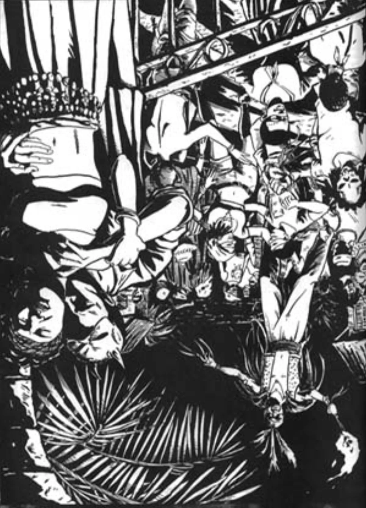

<dl>
<dt>Clan</dt><dd>Ventrue</dd>
<dt>Generation</dt><dd>9th generation</dd>
<dt>Role</dt><dd>Prince of Kingston</dd>
<dt>City</dt><dd>Kingston</dd>
</dl>

Born in Edinburgh, 1849. Banking career in London. Embraced by a Ventrue elder in 1874 who saw in him the perfect colonial administrator — smart, ruthless, and convinced that order was its own justification. Arrived in Kingston in 1891 to establish a Camarilla foothold in Ontario. Never left.

Built the Great Lakes pipeline in the early 1900s as European Kindred sought passage to the New World. The route runs from the Atlantic up the St. Lawrence, through Kingston, across Lake Ontario, through the Welland Canal into Lake Erie, and ultimately to Gary and Chicago. Lucian controls the western terminus. MacLaren controls the eastern one. Between them, they have moved more vampires than any other operation in North America.

CullodenCorp is named for the battle, not the place. MacLaren's mortal family were Jacobites. The name is a reminder of what happens when you fight the wrong war at the wrong time.
