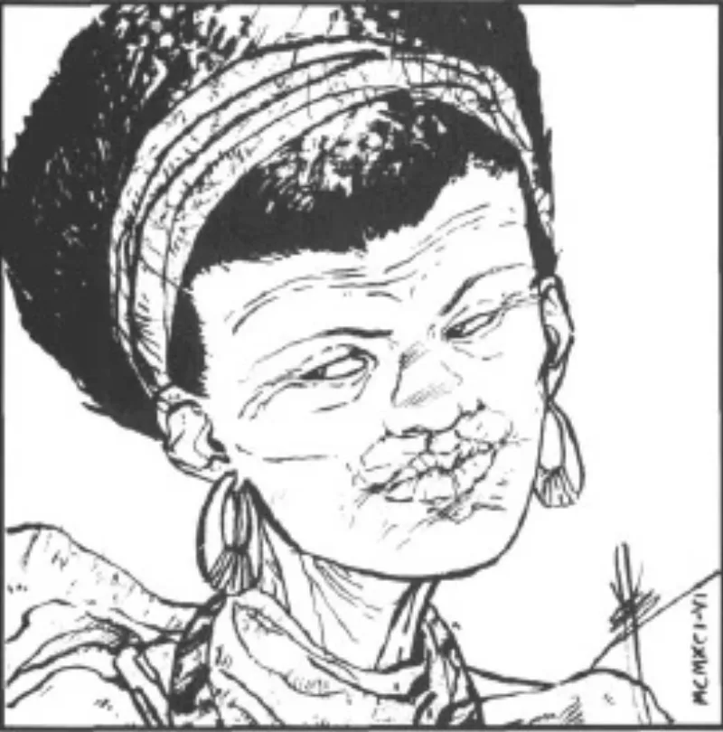

<dl>
<dt>Clan</dt><dd>Gangrel (cover — actually Laibon)</dd>
<dt>Generation</dt><dd>6th generation</dd>
<dt>Role</dt><dd>Gangrel Primogen / pipeline operator</dd>
<dt>City</dt><dd>Chicago</dd>
</dl>

Not Gangrel. Laibon — an African vampire operating under Kindred cover. She has been covertly colonizing the New World with Laibon for an unknown period, smuggling them in through established trade routes and letting the Camarilla assume they are Gangrel immigrants. Her strange abilities — the Leopard Form, her rapport with African werecats, her survival instincts that read as preternatural even by elder standards — derive from her Laibon heritage, a tradition with its own cosmology and disciplines that predates the Camarilla by millennia.

## Pipeline Role

Inyanga touches every node on the Great Lakes corridor:

- **Gary docks:** [Lucian](/npcs/lucian/) imports Laibon through the Gary Export Company on her behalf. The docklands are the entry point; Gary is the staging ground.
- **Chicago-Milwaukee Psychopomp:** Co-operates the underground shuttle with Prince [Mark Decker](/npcs/mark-decker/). The Goblin Roads between the two cities cut through Lupine-haunted wasteland: cornfields that whisper at frequencies below human hearing, roadside memorials where esoteric blood offerings must be laid for safe passage. Travel without the ritual is suicide.
- **Gangrel mobilization:** If word comes from Inyanga, every Gangrel in Chicago listens. In very short order the entire clan can be mobilized.

She is the connective tissue between the water axis (Atlantic → Kingston → Gary → Chicago) and the north-south axis (Chicago → Milwaukee). Every major transit operation in the region passes through infrastructure she controls or influences.

## The Deeper Game

Brokered the truce with the werewolves after Under a Blood Red Moon. Whatever she offered the Lupines, she has never disclosed it.

Can calm Xaviar, the former Gangrel Justicar, with a single word. The nature of their bond is unclear, but it predates his departure from the sect.

In the V20 era, Inyanga pursued [the Heart](/locations/the-heart/) of Osiris — a Coptic jar whose power could awaken an ancient Methuselah at full strength. Beckett confronted her directly: "You're not actually a Gangrel, are you, Mother Inyanga?" She responded ambiguously.

Controlled by [Menele](/npcs/menele/) through extended Domination. She does not know this. Her decisions, loyalties, and strategic instincts are shaped by a Methuselah she has never consciously met. The pipeline is Menele's circulatory system, and Inyanga is its heart.
