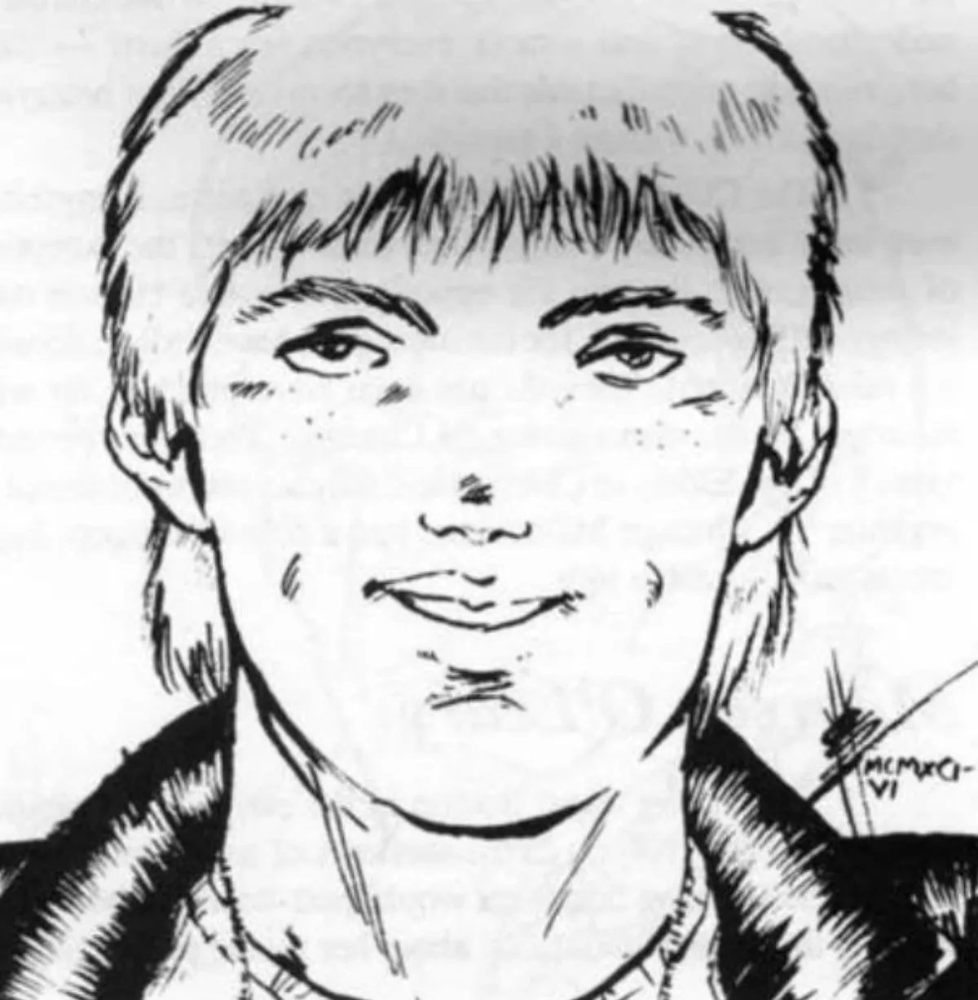

<dl>
<dt>Clan</dt><dd>Gangrel</dd>
<dt>Generation</dt><dd>9th generation</dd>
<dt>Role</dt><dd>Wolf Pack biker / Ramrod's childe</dd>
<dt>City</dt><dd>Chicago</dd>
</dl>

Jackie had been an ardent admirer of Randy "Ramrod" Zelley before the racing great's accident. Then only 10, Jackie swore to become as good a racer as his hero. In the mid-60s Jackie was beginning to make a name for himself among the bikers when he ran into his old hero, looking as healthy and young as Jackie himself. Without telling Ramrod what he suspected, Jackie conspired to become close to the older man and eventually discovered his secret. Threatening to reveal Ramrod's true nature if this gift wasn't shared, Jackie convinced the gang to let him in. Now he and Ramrod constantly compete in showing off their daring and trick-riding skills.

**Image:** Six-foot-tall, blond and blue-eyed. Baby-faced and just a bit pudgy.

**Roleplaying Hints:** Pay no attention to anyone unless they show an interest in bikes. Then become excited and animated.

**Haven:** On the road.

**Secrets:** D+
