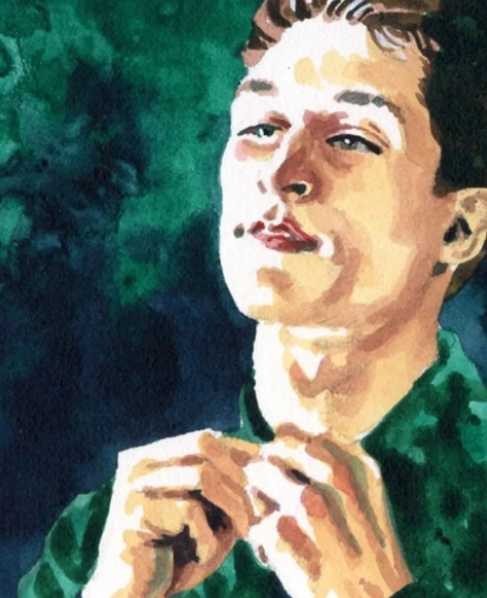

<dl>
<dt>Clan</dt><dd>Malkavian</dd>
<dt>Generation</dt><dd>8th generation</dd>
<dt>Role</dt><dd>Psychopathic Malkavian / [O'Leary](/npcs/maureen-oleary/)'s most dangerous childe</dd>
<dt>City</dt><dd>Chicago</dd>
</dl>

Jason Newberry got his start as a child, pulling the wings off butterflies and burning ants with a magnifying glass. As he got older, he obtained the greatest pleasure by tormenting other children, and once put out another boy's eye with a stick they were using to toast marshmallows. His concerned and wealthy parents managed to keep him out of jail only by sending him to the dank and dismal mental institutions of the 1890s, where he came to the attention of [Maureen O'Leary](/npcs/maureen-oleary/). She became fascinated by this psychotic, sadistic teenager. He most excited her on a visit home, when he set fire to his father and mother. [O'Leary](/npcs/maureen-oleary/) was unable to contain her passion at the moment and leapt upon him, Embracing him next to the smoldering corpse of his father. The 18-year-old's first feeding came courtesy of his dying parents.

O'Leary's fit of passion came at the same time [Lodin](/npcs/lodin/) was wresting the fief of Chicago away from [Maxwell](/npcs/maxwell/). By backing [Lodin](/npcs/lodin/) in his efforts to take over the city, O'Leary was able to get his blessing for the creation of her Neonate. [Lodin](/npcs/lodin/) considers Son the reward to O'Leary for lighting the fire of 1871, and has his own private nickname for the Malkavian: "Gift."

Son has not changed much during the past hundred years. The only difference is that he sometimes prefers mental cruelty to physical torment -- but not always. His preferred method of hunting is to attract a pair of lovers to his Skokie Haven using his strong Presence, feed on them and convince one that he or she has been turned into a Vampire. He will then force that one to drink the blood of the other and then, satiated and happy, use Domination to render his victims forever unable to speak about what happened.

Son publicly claims to be the child of Ben and Paula Smith, and only he, O'Leary and Prince Lodin know the truth. He began doing this merely to tease the couple, since he knows they were not married in life. However, he has also caught himself occasionally believing that he really is their son, and bringing them gifts of chocolates and dead flowers. Recently he has found himself thinking about drinking their Blood.

During the upheavals of the mid-80s, Son killed a Caitiff by draining her of all her Blood. He enjoyed the experience even more than feeding off his parents, and the desire is growing to do it again.

**Notes:** This is an extremely dangerous individual. On meeting him, characters roll a number of dice equal to their Humanity, target number 9. The more successes they roll, the more uncomfortable they feel around him. The more they botch, the more they like him.

**Image:** A vaguely handsome 18-year-old, though mortals (and some high-humanity Cainites) tend to be put off by him. A little under 6 ft tall, with sandy blond hair. Dresses like a well-off young man.

**Roleplaying Hints:** Start ingratiating yourself with characters immediately upon meeting them. Praise and flatter them almost constantly.

**Haven:** A small house in Skokie; occasionally resides in a shelter for abused children there.

**Secrets:** B+
