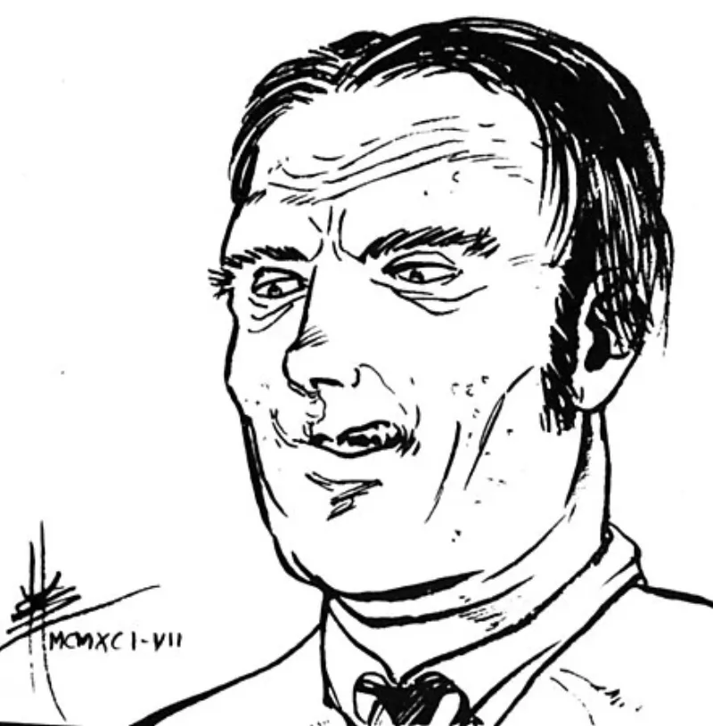

<dl>
<dt>Clan</dt><dd>Ventrue</dd>
<dt>Generation</dt><dd>8th generation</dd>
<dt>Role</dt><dd>Media Baron</dd>
<dt>City</dt><dd>Chicago</dd>
</dl>

Joseph Peterson was born in 1938, which means he came of age in Chicago journalism during the final decade of Colonel Robert R. McCormick's reign over the Tribune. McCormick died in 1955, but his editorial posture — isolationist, anti-New Deal, reflexively hostile to organized labor, civil rights, and anything that smelled like eastern liberal establishment — survived him in the newsroom for another fifteen years. Peterson thrived in that atmosphere. He was not a reporter who happened to hold conservative views. He was a polemicist who happened to work at a newspaper.

Through the 1960s, Peterson led the Tribune's editorial resistance to the civil rights movement with a conviction that never wavered because it never examined itself. He covered the 1966 Chicago Freedom Movement — Martin Luther King Jr.'s open housing marches through Marquette Park and Gage Park — as an outside agitation story. He framed the 1968 Democratic Convention riots as proof that permissiveness breeds disorder. Words like "objectivity" and "fairness" existed in his vocabulary as things other people hid behind when they lacked the courage to take a position.

The Tribune began changing in the early 1970s. New ownership brought new editors. The paper won Pulitzer Prizes in 1971, 1973, and 1976 for investigative reporting — the kind of journalism that questioned institutional power rather than defending it. Peterson watched colleagues he had trained pursue stories about police corruption, housing discrimination, and political graft. The new Tribune was precisely the paper McCormick's ghost would have killed. Peterson left rather than adapt.

What followed was a decade of diminishing returns. He became a media consultant, which in practice meant advising conservative political campaigns on press strategy. Most of his clients lost. He taught part-time at Daley Community College, delivering the same lecture on media ethics — his version of ethics, where the press served the state by shaping public opinion rather than informing it — to classrooms of bored community college students. The lecture had not changed in years. He gave it with the same conviction he brought to everything, which was the conviction of a man who had never once reconsidered a position.

Lodin heard about Peterson from a state senator in the early 1970s and attended one of the Daley College lectures. What Lodin saw was not a journalist but a weapon: a man who understood how to suppress information, redirect narratives, and intimidate sources, and who would do all of it without moral hesitation because he had convinced himself that controlling information was a public service. Lodin offered the Embrace. Peterson accepted without reservation. The year was 1972.

As a Kindred, Peterson became Chicago's primary Masquerade enforcer in the media sphere. He feeds exclusively on journalists — a feeding restriction that doubles as professional contempt. Reporters who stumble onto Kindred activity find their careers destroyed, their sources threatened, their editors Dominated. Peterson runs the Tribune and Sun-Times through layers of blood-bound editors and mortal proxies. He visits City Hall regularly, maintaining the relationships that keep inconvenient stories from reaching print.

He now prefers "Joseph" and compares himself to the biblical Joseph — sold into slavery by his brothers, risen to power in a foreign court. The analogy flatters him. Conscience 0, Self-Control 1, Humanity 3. Whatever capacity for self-reflection he once possessed died before Lodin found him.
