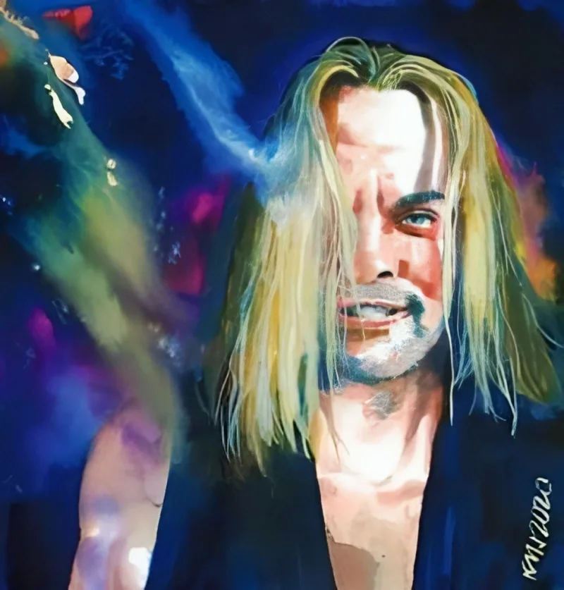

<dl>
<dt>Clan</dt><dd>Brujah</dd>
<dt>Generation</dt><dd>8th generation</dd>
<dt>Role</dt><dd>Anarch of Gary</dd>
<dt>City</dt><dd>Gary</dd>
</dl>

Born Iacopo Manzini into a prosperous Italian merchant family. Attended the University of Vicenza, graduated 1840. Walked to Germany in 1845 to work for the revolution. Participated in the Cincinnati riots of 1853, sustained fatal injuries, and was Embraced by a Kindred named Elle.

Came to Chicago after [Maldavis](/npcs/maldavis/)'s defeat. Blood-bound through [Tyler](/npcs/tyler/) to [Helena](/npcs/helena/). He is unknowingly a piece on Helena's Methuselah chessboard — the Brujah anarch who thinks he acts freely but whose blood loyalties trace back to a 4th-generation Toreador playing a game older than nations. This is critical foreshadowing for Act V. Helena wanted Juggler to lead the Anarchs, not take Chicago — a distinction he understood too late. A failed coup pushed him to Gary, where he proclaimed himself [Baron](/npcs/baron-vulture/). The title means what he can enforce and nothing more.

Maintains an old haven on Chicago's Northside. The Gary operation is not his only operation.

The codependent [Modius](/npcs/modius/) relationship: he cannot imagine existence without Modius as an opponent. Hate is his last remaining passion. Without it, the performance collapses and whatever Juggler actually is — if anything remains — would have to look at itself. He will never allow Modius to be destroyed by anyone else.

Nature: Jester. The performance is the point. The party-man persona, the dramatic Brujah rebel, the Italian merchant's son — all masks. What lies underneath may be nothing at all, or something none of Gary's Kindred have the tools to recognize.

Speaks Italian when angry but otherwise carries no accent. Never blinks. Steeples his fingers when listening, throws his arms wide when making a point. Constantly fiddles with small objects — coins, matchbooks, bottle caps. Practiced prestidigitation. The hands never stop moving.
