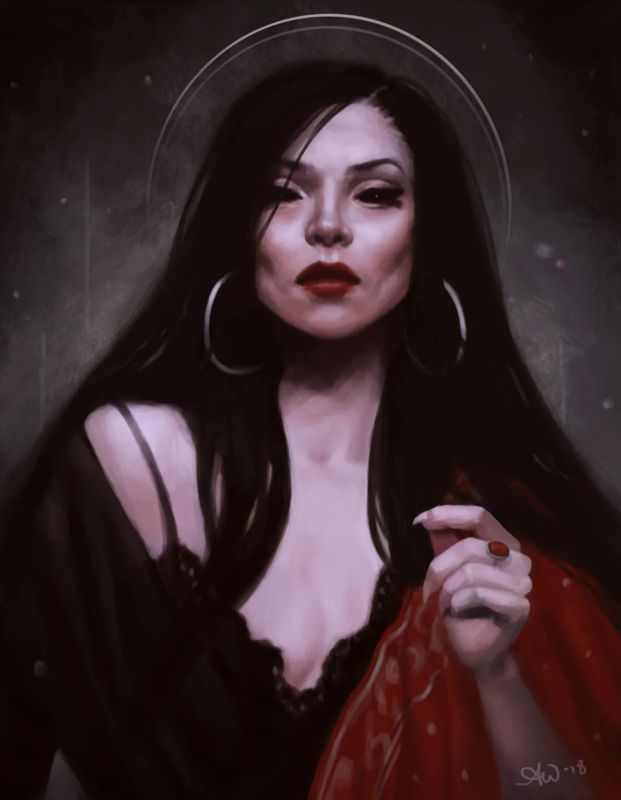

<dl>
<dt>Clan</dt><dd>Toreador</dd>
<dt>Generation</dt><dd>10th generation</dd>
<dt>Role</dt><dd>Toreador guitarist / Baby Chorus co-founder</dd>
<dt>City</dt><dd>Chicago</dd>
</dl>

Kathy's burning ambition since age ten was to be the world's greatest guitarist. By 1971, at fifteen, nothing else mattered. She faced the same problems shared by many talented female musicians of the era — fans did not accept female rock guitarists. She refused to add lyrics to her songs, knowing they would detract from the power of her performance. This ensured her status as a minor local cult figure rather than a performer with a national reputation.

Her playing attracted Tamoszius, who had felt nothing but disdain for rock 'n' roll until he heard her. After three months of attending every performance, the diminutive violinist offered her an eternity to perfect her musical gift. Kathy accepted eagerly.

She was beginning to grow bored with rock when punk arrived. She was slow to join the radical movement, but when she did she jumped in with a vengeance. She is one of the founding members of Baby Chorus, and her talent is a key reason the band has found such a strong local following. She is still likely to rip into an improvised solo which leaves the other band members with nothing to do on stage for up to an hour.
