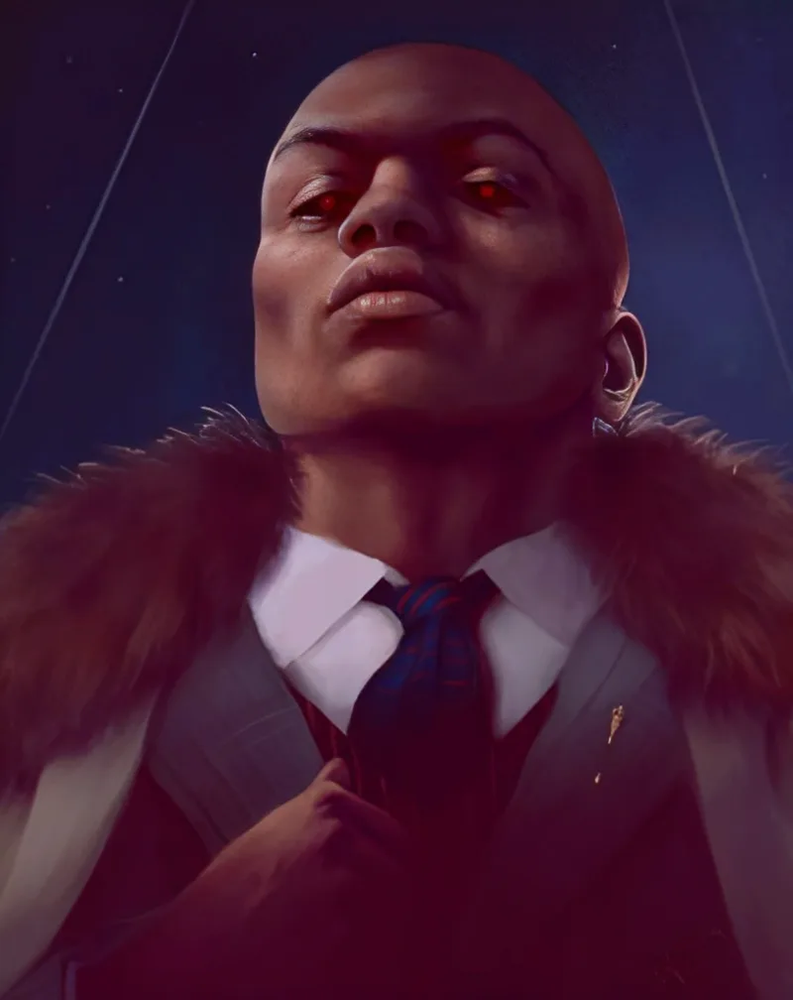

<dl>
<dt>Clan</dt><dd>Ventrue</dd>
<dt>Generation</dt><dd>8th generation</dd>
<dt>Role</dt><dd>[Cabrini Green](/locations/cabrini-green/) Warlord</dd>
<dt>City</dt><dd>Chicago</dd>
</dl>

Kevin Jackson was born in 1964 on the west side of Chicago, in a neighborhood where the Bloods had already replaced civil infrastructure as the governing authority. His mother worked two jobs and kept the apartment clean. His two older brothers ran corners by the time Kevin was ten. The question was never whether he would join. The question was how fast he would rise.

Both brothers cleared the path. One stayed in Chicago and built the local franchise. The other relocated to Los Angeles in the late 1970s, riding the Bloods' westward expansion into Compton and Watts, and eventually became one of the gang's senior figures on the West Coast. Kevin inherited the Chicago operation's middle tier by his late teens — not through vision or ruthlessness but through proximity. He was the younger brother who showed up, did what was asked, and remembered details. The Bloods promoted reliability over ambition. By 1980, Kevin controlled distribution in the Near North Side projects. By 1984, he ran cocaine out of [Cabrini Green](/locations/cabrini-green/).

[Cabrini Green](/locations/cabrini-green/) in 1984 was not a housing project in any meaningful sense. It was a vertical city of sixteen thousand residents in seventy buildings, and the Chicago Housing Authority had abandoned maintenance a decade earlier. Elevators stopped working. Hallways went unlit. The towers at 1230 North Burling became open-air drug markets with armed sentries on the rooftops scanning for police and rival gangs. The Crips, the Almighty Playboys, the Vice Lords — Kevin had grown up hating all of them with the uncomplicated loyalty of a soldier who never questioned the flag. He did not need to. His brothers had done the thinking. He did the holding.

[Lodin](/npcs/lodin/) noticed him because [Lodin](/npcs/lodin/) was watching the decay of the Italian mob infrastructure that [Capone](/npcs/capone/)'s Kindred had spent decades building. The Outfit's grip on the drug trade was loosening. Black gangs were taking territory the Mafia could no longer defend. [Lodin](/npcs/lodin/) wanted a lever inside that new power structure, and Kevin Jackson — connected but not visionary, loyal but not independently ambitious — fit the profile of a childe who would serve rather than scheme.

The Embrace in 1984 was not a seduction. Lodin used Dominate to compel acceptance. Kevin woke up dead in a Cabrini Green apartment with blood on his mouth and Lodin standing over him explaining the rules. The inherent racism in that method — the assumption that a Black gang leader needed to be forced into compliance rather than recruited — was not lost on Kevin, though he filed it rather than acted on it. He had spent twenty years filing grievances in exactly that way.

What Lodin never understood was that Kevin did not stop being a Blood when he became Kindred. He told his lieutenants. He fed on rival gang members openly enough that the children in the towers started telling stories about the man on the fourteenth floor. And he used the Los Angeles connection — his brother, now also Embraced in secret — to build a shadow dynasty. Three unauthorized childer in the Anarch capital, all Bloods, all building toward a takeover of the gang's national structure. The L.A. program is Kevin's real ambition. Chicago is the throne room. Los Angeles is the armory.

His haven in Cabrini Green reflects both lives. Armed sentries with flamethrowers and white phosphorus grenades patrol the perimeter. The guards listen when children report monsters in the stairwells, because sometimes the monsters are real and sometimes they work for Kevin. Humanity 8 coexists with paramilitary infrastructure. He has not lost himself. He has organized himself into something Lodin never anticipated.
