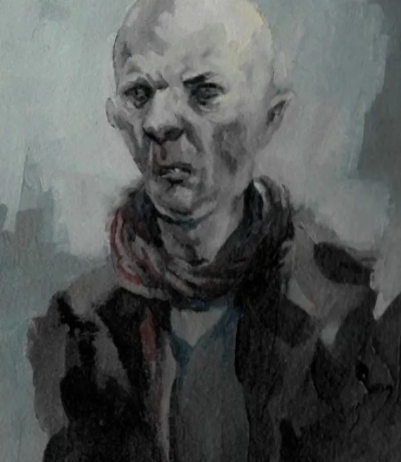

<dl>
<dt>Clan</dt><dd>Nosferatu</dd>
<dt>Generation</dt><dd>6th generation</dd>
<dt>Role</dt><dd>Nosferatu Primogen</dd>
<dt>City</dt><dd>Chicago</dd>
</dl>

Born in the Levant. Embraced by **Alexius**, a Byzantine Nosferatu Prelate. Alexius was himself Embraced by the same Ashirra who sired **Tarique** — 5th-generation Nosferatu, Steward of Mecca, Humanity 10, Thaumaturgy 5, and leader of the **Hajj Nosferatu** (the most respected Nosferatu in the Islamic world). This makes Khalid part of a bloodline that guards holy sites and maintains connections across the entire Middle East.

Khalid is an old friend of **Talaq** — a former Assamite warrior (Embraced AD 106 during the Roman sack of Petra) who used a Kabbalistic ritual to reverse his vampirism in 1515. Talaq now rules the hidden city of Petra in Jordan, controlling King Hussein as a pawn, with 1,200 Nabataean descendants as his personal army. Khalid would never reveal Talaq's existence or location. Enemies hunting Talaq: Assamites (consider him a traitor), Followers of Set, and the Mossad (through the mage Rambam/Maimonides).

The Hajj Nosferatu possess a unique Thaumaturgy path — **Hidea Iman** (Gifts of Faith) — that emulates True Faith. Khalid's oblique references to his mortal faith are not nostalgia. They are echoes of a bloodline that never fully abandoned the sacred.

**Story hook:** If the coterie needs something from Khalid in Acts II-III, his price might be a delivery to Talaq in Petra — a package that cannot be opened, cannot be discussed, and must arrive before the next new moon. The delivery forces the coterie into Assamite territory, Setite surveillance, and a mortal security apparatus that protects a dead city in the Jordanian desert.
