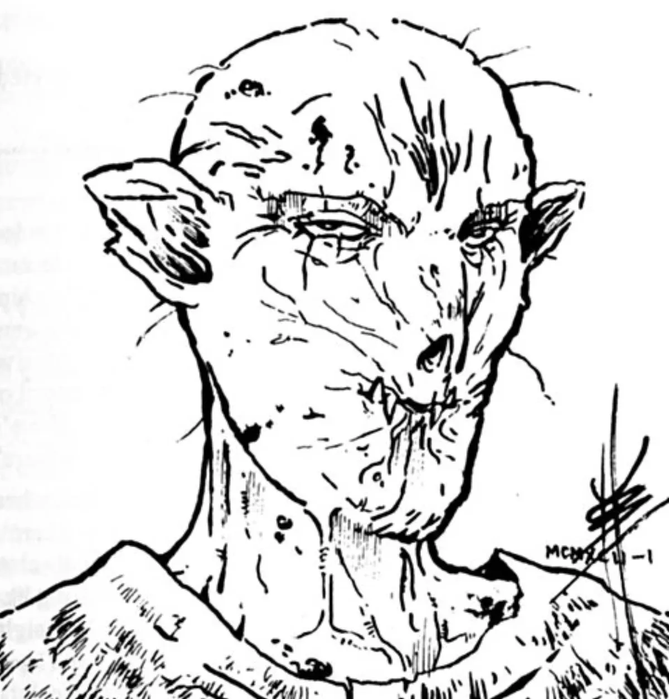

<dl>
<dt>Clan</dt><dd>Nosferatu</dd>
<dt>Generation</dt><dd>8th generation</dd>
<dt>Role</dt><dd>Leader of [Parovich](/npcs/parovich/)'s fugitive childer</dd>
<dt>City</dt><dd>Milwaukee</dd>
</dl>

Embraced in 1985. Kristian killed his abusive father with a baseball bat at age 16 and was in his third year in Juvenile Hall when [Parovich](/npcs/parovich/) attacked him in his sleep. [Parovich](/npcs/parovich/) taught him about Kindred existence. Kristian became popular among the Elders by spying on Parovich and reporting to Council visitors.

When Kristian learned Parovich had connections to the Sabbat — a Ghoul messenger from the Black Hand arrived at the house — he grabbed his "brother and sisters" and told them to flee into the city. Two of the childer are already dead. Kristian considers going to the Elders but fears they will side with Parovich. He visits [Anastasia](/npcs/anastasia/) weekly, bringing flowers or perfume.

Lean and compact body. His violent childhood taught him virtues of justice as well as strength. Hard but noble look under Nosferatu wrinkles and warts.

**Apparent Age:** Early 20s
**Embrace:** 1985
