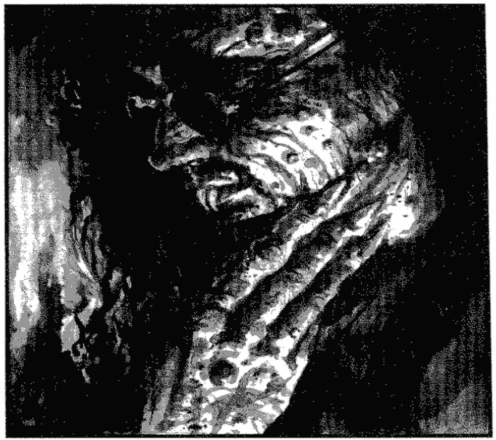

<dl>
<dt>Clan</dt><dd>Nosferatu</dd>
<dt>Generation</dt><dd>8th generation</dd>
<dt>Role</dt><dd>Prince of Baton Rouge / Nosferatu spymaster</dd>
<dt>City</dt><dd>Chicago</dd>
</dl>

Lawrence no longer resides in New Orleans, but was and is the most influential Nosferatu the city has ever known. He came to the city in 1805, joined Prince Doran's spy network in the same year, and headed it from 1830 to 1885. He decided there were far too few Nosferatu doing the job he felt only they were truly suited to do. The network relied too much on information from other clans.

To solve the problem, he created three childer — [Avery](/npcs/avery/), [Roger](/npcs/dr-roger-liverman/), and [Martin](/npcs/martin-drichet-aaron-carson/) — and brought them into the network. He taught them his techniques and molded them into his perfect spies. While the first two lived up to Lawrence's expectations, the third far exceeded them. [Martin](/npcs/martin-drichet-aaron-carson/) learned everything he could from his sire; when Lawrence retired from the prince's service, he turned over his position to his third childe.

After retiring, Lawrence lived in [the French Quarter](/locations/the-french-quarter/) for several years but, during World War I, moved to Baton Rouge and assumed that city's princeship. While this would seem to be the base of his power, barely a handful of vampires reside in Baton Rouge. Because of the secrets he learned during his years in the network, most of Louisiana's Kindred fear and respect him.
