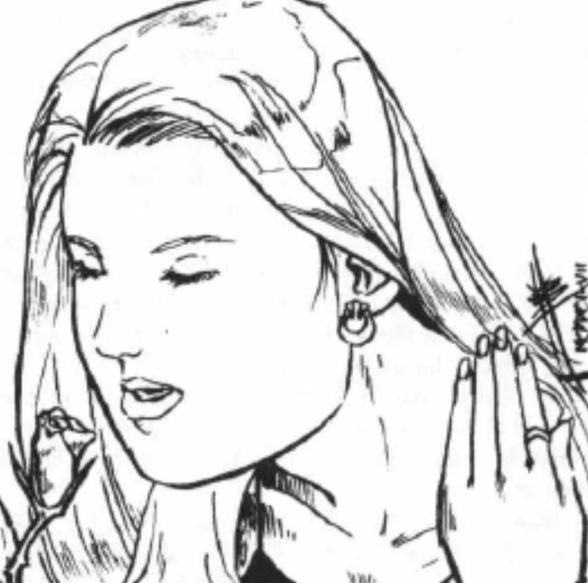

<dl>
<dt>Clan</dt><dd>Ventrue</dd>
<dt>Generation</dt><dd>8th generation</dd>
<dt>Role</dt><dd>[Lodin](/npcs/lodin/)'s consort / great-great-granddaughter</dd>
<dt>City</dt><dd>Chicago</dd>
</dl>

Lorraine Matthews' family has long been a power not only in Chicago politics but in Illinois, the Midwest, and occasionally on the national level. Though she does not know it, she is the great-great-granddaughter of [Lodin](/npcs/lodin/). She spent her early life happily playing on her family's rich estates and being groomed for a life of public service and private gain. However, four years at Northwestern University brought a change in her attitude. She got heavily into both drugs and self-sacrifice, and signed up to join the Peace Corps upon graduation.

[Lodin](/npcs/lodin/) met his great-great-granddaughter for the first time at a private party right after graduation, where he was hunting one of her friends. He quickly changed targets to this enchanting young woman. As they walked along the shore of Lake Michigan, the Prince found himself becoming more and more interested in this unique young lady, who was like no one he had ever met before (a head full of LSD was doing much to accentuate her natural strangeness).

Instead of feeding on her, [Lodin](/npcs/lodin/) kept talking with her almost till dawn, when he realized he had fallen in love with her. Minutes before the sun was to rise he told her what he was and invited her to join him in immortality. The tripping Lorraine was more than happy to do so. After the transformation, the pair retired to the nearby Matthews estate to sleep. However, the LSD now coursing through both their systems made sleep impossible, and for the first time in more than a century, [Lodin](/npcs/lodin/) stayed up through the day. At his beloved's urging, the two went outside and endured almost five seconds of bright sunlight before rushing back to the basement.

At first, [Lodin](/npcs/lodin/) was afraid to reveal Lorraine's existence, since in creating her he had violated his recent pledge to seek approval from the Primogen. He managed to extract promises from a majority of the Elders to support his decision. He kept her heavily Dominated until he became convinced that she really loved him. Since deciding she does indeed love him, he has spent every available moment with her.

She feeds on the blood of drug-users and he in turn feeds on her Blood, an arrangement he keeps very secret. Indeed, it was this arrangement which made his abduction in Ashes to Ashes so easy. She avoids the other Kindred in Lodin's broods, and is the only female Vampire he ever created.
