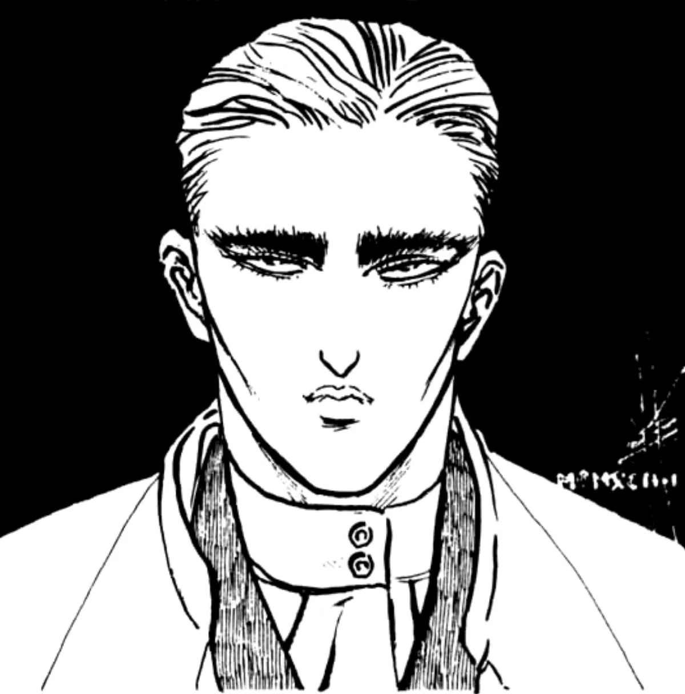

<dl>
<dt>Clan</dt><dd>Toreador</dd>
<dt>Generation</dt><dd>9th generation</dd>
<dt>Role</dt><dd>Toreador Elder, sculptor, culture guardian</dd>
<dt>City</dt><dd>Milwaukee</dd>
</dl>

Embraced in 1793, born 1762. Son of French nobles who supported the arts and the people, and were repaid with the guillotine during the Revolution. Natasha rescued him from execution, having seen his sculptures, and hoped to keep him alive to make more. They fled to Venice, then Rome, then went separate ways.

Louis came to America hoping for a land free from war. The Civil War sent him north to Milwaukee. He never forgave the lower classes for the murder of his parents and detests anyone of lower social class. Together with [Lucina](/npcs/lucina/), he fights to preserve culture against the Anarchs. He has been in Milwaukee longer than almost any other Kindred and knows much of what goes on and has gone on in the city.

An extremely cultured gentleman with impeccably combed black hair and just a hint of make-up on his pasty, pale face. Has a way of making everybody feel underdressed no matter the situation.

**Apparent Age:** 30
**Embrace:** 1793 (born 1762)
