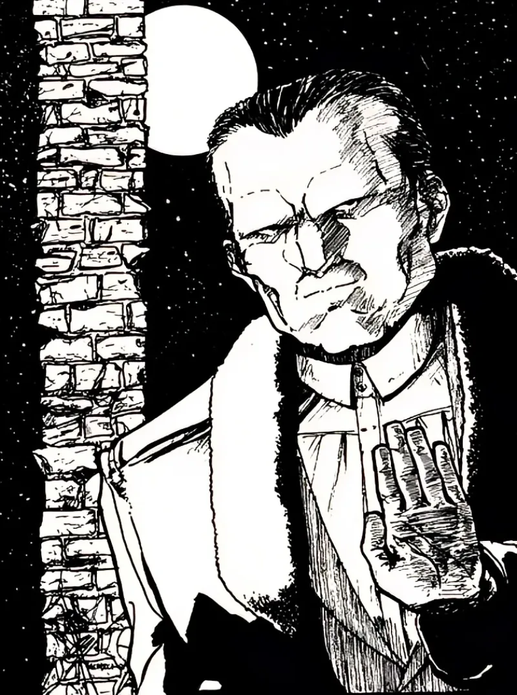

<dl>
<dt>Clan</dt><dd>Gangrel</dd>
<dt>Generation</dt><dd>8th generation</dd>
<dt>Role</dt><dd>Elder at the Docks / pipeline operator</dd>
<dt>City</dt><dd>Gary</dd>
</dl>

Owns the Gary Export Company. Controls the passage of vampires traveling to and from Chicago via the Atlantic. The docks are not a business — they are an immigration checkpoint that no one voted on and no one can appeal. Six centuries of accumulated power: Animalism 5+, Fortitude 5+, Protean 5+ (Mist Form, Earth Meld, Flesh of Marble). You do not fight Lucian. You route around him or you die.

## The Great Lakes Pipeline

Lucian operates the Gary terminus of a continental smuggling corridor. The water axis: Atlantic → St. Lawrence River → Kingston → Lake Ontario → Great Lakes → Gary docks → Chicago. The road axis connects via I-94 to Detroit, and from Kingston via the 401 to Toronto and Montreal.

Has a lucrative working arrangement with [Iain MacLaren](/npcs/iain-maclaren/), Prince of Kingston, Ontario, for ferrying vampires down the St. Lawrence through the Great Lakes. [MacLaren](/npcs/iain-maclaren/) controls the entry point. Lucian controls the destination. The pipeline is old, quiet, and profitable. The proceeds fund [MacLaren](/npcs/iain-maclaren/)'s entire operation in Kingston.

Is importing Laibon — African vampires — on behalf of [Inyanga](/npcs/inyanga/)'s covert diaspora operation. [Inyanga](/npcs/inyanga/) is actually Laibon, not Gangrel. The distinction matters to those who know it, and Lucian knows it. The docklands are the entry point; Gary is the staging ground.

When Baltic port traffic stops — shipments from Scandinavia and Eastern Europe cease arriving — Lucian's shipping contacts will be among the first to notice. Something is wrong in Russia. This is the Shadow Curtain.

The dock pipeline [Darius](/darius-cole/) is building for [Chuc Luc](/npcs/chuc-luc/) runs parallel to, and potentially threatens, Lucian's existing international smuggling operation. If Lucian discovers a competing route through his own waterfront, the response will not be a conversation.

## What Lucian Values

Speaks like orders are gravity. Gives silence instead of reassurance. Values compassion — that is his only accessible weakness. He has watched civilizations rise and fall from this waterfront. The docks are his because he was here before the docks existed.
