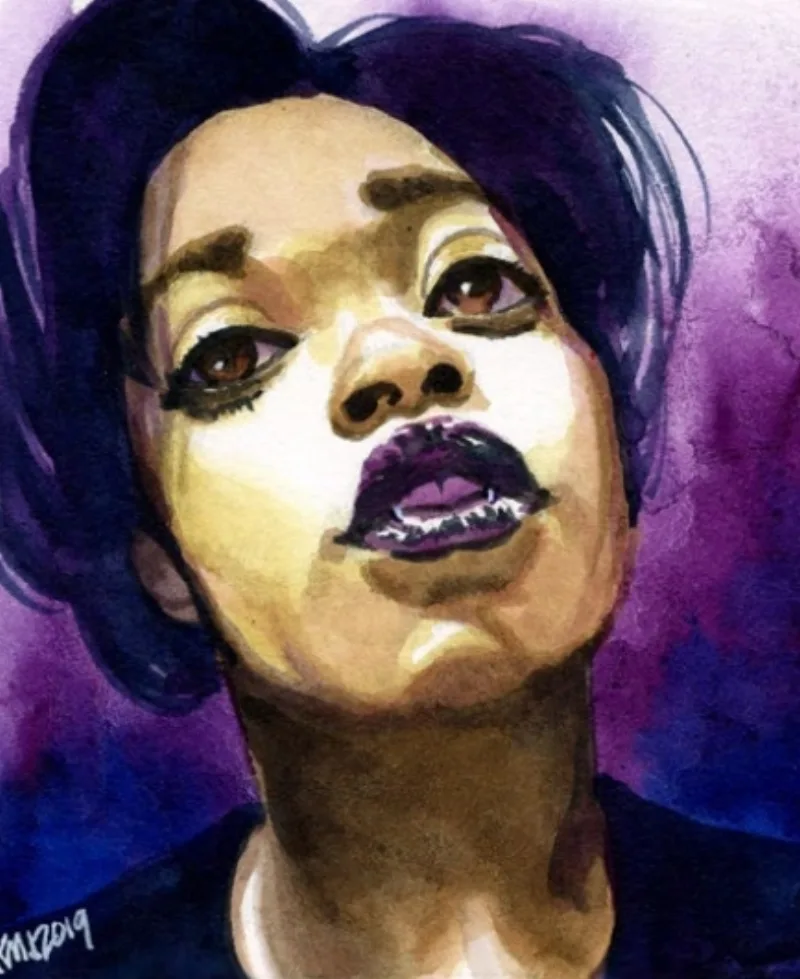

<dl>
<dt>Clan</dt><dd>Caitiff</dd>
<dt>Generation</dt><dd>8th generation</dd>
<dt>Role</dt><dd>Idealist</dd>
<dt>City</dt><dd>Chicago</dd>
</dl>

Carol Davis was born in 1955 on Chicago's South Side, raised in a family that carried its wounds quietly. One wound in particular: a great-uncle named Abraham, said to have been killed by the Klan sometime after World War I. The family kept his photograph. They spoke his name at holidays. He became the kind of ghost that families build myths around — the lost one, the stolen one, the man who deserved better than what America gave him.

In 1980, Carol walked into a jazz club on the South Side and saw her great-uncle standing at the bar. He had not aged a day since the photograph was taken. Same face. Same hands. Same man, six decades later, unchanged.

She told him who he was. She told him her grandmother's name. She told him the family thought he was dead.

[Abraham DuSable](/npcs/abraham-dusable/) — Tremere, Embraced sometime after the Great War, the details of his turning unknown to Carol — reacted with horror. He had built his unlife on the assumption that everyone who knew him as a mortal was gone. He told her to come with him, promised to explain. Then his Beast took over. Fear of discovery, desire, the hunger that does not negotiate. He drained her. In the aftermath, revolted by what he had done, he slit his wrist and let a single drop of vitae fall into her mouth. Then he fled into the night.

She was rescued by Dickie, an Anarch who had been tailing [DuSable](/npcs/abraham-dusable/). Dickie taught her the basics — what she was, what the blood did, how to survive the first nights. Carol Davis became Maldavis. She became a Caitiff, the only known Caitiff in Chicago not sired by a Brujah or another Caitiff. Tremere vitae in a clanless vessel.

She never revealed [DuSable](/npcs/abraham-dusable/)'s identity. Family loyalty ran deeper than Kindred politics. The man had killed her. He was still her blood.

By the early 1980s, the Primogen had noticed her. [Annabelle Triabell](/npcs/annabelle-triabell/) and [Critias](/npcs/critias/) both fed her their vitae — grooming her, though she did not fully understand the shape of the grooming. They wanted a weapon aimed at [Lodin](/npcs/lodin/). Maldavis recruited Anarchs, built alliances within city government, and launched an open war against the Prince. For a time, she had the upper hand.

[Lodin](/npcs/lodin/) ran to the Primogen and swore eternal obedience. The vote came down 4-3 in his favor. Maldavis's rebellion collapsed. Most of her followers died.

She survived. Not because [Lodin](/npcs/lodin/) lacked the will to kill her, but because the Primogen found her useful as a threat — a trump card to keep Lodin obedient. What none of them understood was that the entire rebellion had been a proxy action in the ancient war between [Helena](/npcs/helena/) and [Menele](/npcs/menele/). [Menele](/npcs/menele/) sacrificed Maldavis to make [Helena](/npcs/helena/) believe she controlled [Annabelle](/npcs/annabelle-triabell/). The reformer's crusade was a Methuselah's gambit. Maldavis does not know this.

Now [Rebekah](/npcs/rebekah/), the Inconnu Monitor, guides Maldavis toward Golconda through dreams. Humanity 10. Willpower 10. The only candidate for Chicago's throne who might deserve it, and the one least likely to survive the process of claiming it.
