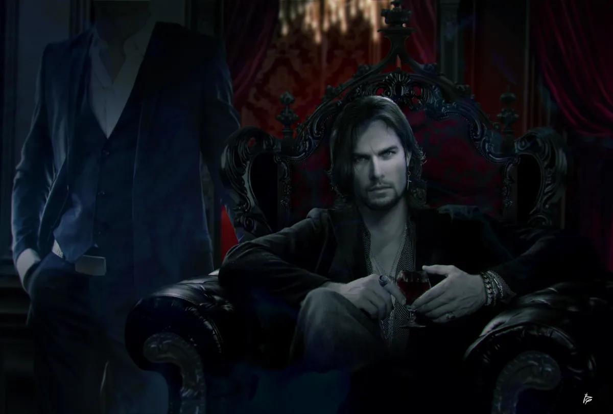

<dl>
<dt>Clan</dt><dd>Ventrue</dd>
<dt>Generation</dt><dd>8th generation</dd>
<dt>Role</dt><dd>Prince of New Orleans</dd>
<dt>City</dt><dd>New Orleans</dd>
</dl>

Born in Louisiana, Confederate cavalry veteran, Embraced by Ventrue elder Lothar Constantine after the Civil War — along with his brother [Jereaux](/npcs/jereaux-guilbeau/), who arranged Constantine's death shortly after. The brothers came to New Orleans; [Jereaux](/npcs/jereaux-guilbeau/) positioned Marcel as Doran's spy and political protégé.

When Prince Doran was murdered (most believe in the 1950s), Marcel moved immediately, using the spy network and blackmail material to secure the princedom. Many suspect Marcel ordered the killing; many more suspect [Jereaux](/npcs/jereaux-guilbeau/). The Gangrel [Roxy](/npcs/roxy/) has spent decades trying to prove it.

Marcel runs an open city, welcoming refugees, but the policy has limits — and limits create power. Everyone who owes their presence in the city owes Marcel.

**The brother:** Marcel almost never speaks [Jereaux](/npcs/jereaux-guilbeau/)'s name. He makes decisions after spending nights at the plantation. Jereaux is his enforcer, his confessor, and the one thing that could destroy him if it ever became public that the murder of Doran was the brothers' coup.

**Feeds only on young men.** Attractive ones. This is not a secret among the Kindred.
