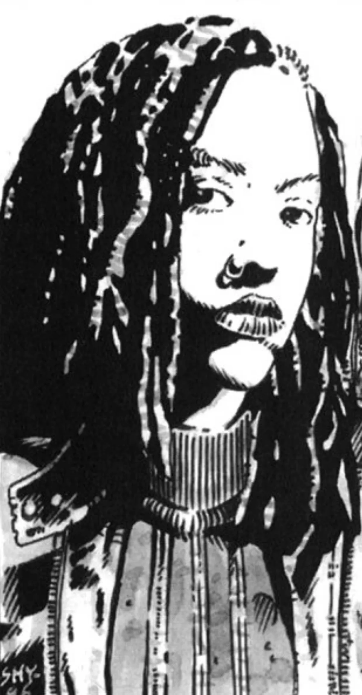

<dl>
<dt>Clan</dt><dd>Tzimisce</dd>
<dt>Generation</dt><dd>10th (raised from 12th through diablerie) generation</dd>
<dt>Role</dt><dd>Librarian, vitae specialist</dd>
<dt>City</dt><dd>Montreal</dd>
</dl>

Originally a member of La Belle Mort ("The Beautiful Death"), a nomadic pack of European Tzimisce, Marie-Ange occasionally traveled to Montreal, her city of birth, to confer with the newly established Librarians. It was here that she met Beatrice L'Angou and began their intimate friendship.

Members of La Belle Mort were recruiters for the Sabbat who traveled the globe in search of new bloodlines and clans. Since many of the Kindred they encountered refused to join the Sabbat, the pack destroyed them, allowing Marie-Ange to drink their blood. This recruiting campaign took the pack into British-controlled portions of the Orient and into direct conflict with the local supernatural beings. During the Chinese Boxer Rebellion, Marie-Ange's pack was decimated, leaving her the sole survivor. With nowhere left to go, she returned to Montreal and was admitted into the Librarians as the resident expert on Cainite and exotic vitae.

In 1996, Marie-Ange began having visions of the Snake Pit, Montreal's destroyed Setite temple. Determined to uncover the significance behind her waking dreams, Marie-Ange explored the burned-out ruins of the temple and uncovered what appeared to be the unconscious body of the infernalist [Sangris](/npcs/sangris/), who was supposedly destroyed in 1992. Marie-Ange hid the Serpent in her haven, hoping to unravel the mystery behind his miraculous survival, partial amnesia and the strange quality of his vitae.

Marie-Ange's mysterious guest is none other than the Damned DeSoto's confused soul, which is trapped in [Terrence](/npcs/rev-terrence-coleman/) DeBouville's transformed body. Inspired by Sangris' memories, DeSoto is turning Marie-Ange's thirst for knowledge into something darker.

Marie-Ange's lab and adjoining rest quarters have been declared off-limits to everyone (supposedly to maintain the integrity of Marie-Ange's work, but, in truth, to hide her visitor).

**Image:** Marie-Ange is a beefy, rugged, black-haired woman who dresses in comfortable work attire. She uses Vicissitude to bring her veins to the surface of her skin, making her look like a pulsating road map.

**Secrets:** Marie-Ange is being corrupted through her protection of the person she believes is Sangris.
