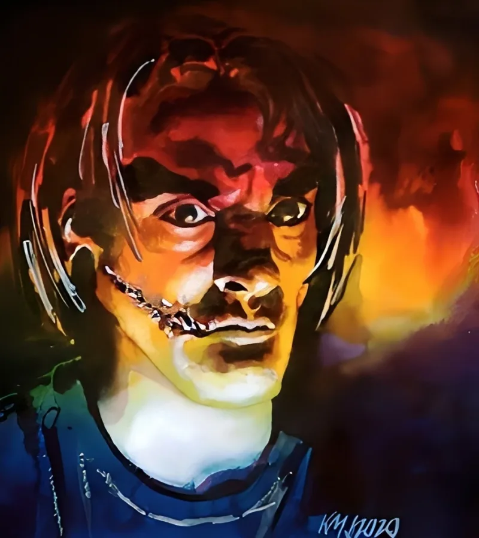

<dl>
<dt>Clan</dt><dd>Gangrel</dd>
<dt>Generation</dt><dd>9th generation</dd>
<dt>Role</dt><dd>Anubi Commander</dd>
<dt>City</dt><dd>Milwaukee</dd>
</dl>

Born in Milwaukee. Built the Anubi from grief and vengeance — a Gangrel war coterie forged in nightly combat against the Lupine packs pressing Milwaukee's borders.

Co-operates the "Psychopomp" — an underground shuttle between Milwaukee and Chicago — with [Inyanga](/npcs/inyanga/). The Goblin Roads between the two cities run through Lupine-haunted wasteland: cornfields that whisper below the range of human hearing, roadside memorials where esoteric blood offerings are laid at each crossing. Skip the ritual and the road swallows you. The cornfields, the whispers, the blood on cracked asphalt — this is what separates two of the largest Kindred populations in the Midwest.

Knows the Lupines want King Distilleries shut down. The docklands operation is an irritant to the werewolves — industrial pollution, spiritual corruption, whatever the Garou cosmology calls it. Decker is willing to trade King Distilleries for werewolf cooperation against the Sabbat. A dock for an army. The math works if the Lupines can be trusted to hold their end.

Identified as Prince of Milwaukee in the post-Psychomachia era (V20 Ghouls & Revenants). The boy with the Lupine-scarred throat and the old eyes, ruling a city that should have fallen years ago.
