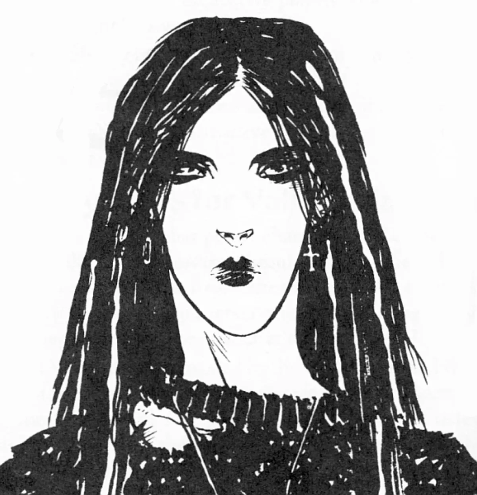

<dl>
<dt>Clan</dt><dd>Mage (Hollow Ones)</dd>
<dt>Role</dt><dd>Hollow One cabal leader</dd>
<dt>City</dt><dd>Chicago</dd>
</dl>

Born in rural Oklahoma. Cherokee on her mother's side, English and Swedish on her father's. Ran away at fourteen after her Awakening manifested as a violent poltergeist event that destroyed her family's kitchen and hospitalized her stepfather. Hitchhiked to Chicago. Found The Sepulcher, which was then an abandoned church. Rebuilt it over three years with her hands and her magic.

The barbed wire in her hair started as a dare. Now it is a magical focus — the pain grounds her, the metal channels her Matter affinity, and anyone who tries to grab her by the hair learns why that was a mistake.

The thrash band is called Razorwire Communion. They are actually good.
