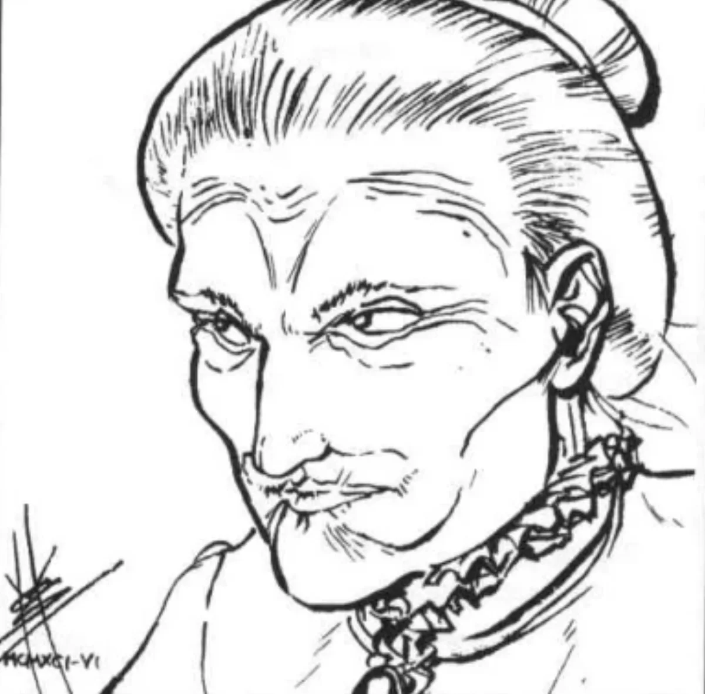

<dl>
<dt>Clan</dt><dd>Malkavian</dd>
<dt>Generation</dt><dd>7th generation</dd>
<dt>Role</dt><dd>Malkavian Matriarch / arsonist of the Great Chicago Fire</dd>
<dt>City</dt><dd>Chicago</dd>
</dl>

Everything about Boston in the early 1800s terrified Maureen as she grew up in the shadows of its colonial monuments. The looming buildings would peer down on her as she walked, the streets would talk about her as she passed and the strangers were all vile devils seeking to rip her soul from her body. Even her rich family despised her and shut her away in terrifying mental institutions. Only death offered her a way out, and she first tried to kill herself when she was 27.

Thirteen years and fifteen attempts later, she finally believed she had succeeded. It required a leap from the steeple of the old North Church, and as she collided with the earth she could feel the cursed life fleeing her crippled shell. She sensed Death approaching, and in those moments she thought more clearly than she ever had before. There was a sharp pain in her neck, and then blessed peace. Suddenly she awoke to pain, searing pain. As she screamed she heard a cruel laugh fading into the darkness.

Maureen is still crippled in her natural state, and needs three additional Blood Points every day just to heal so she can walk. She is constantly hunting. This, and a feud with Lasker (her Sire) forced her to leave her Boston home. She is the oldest Malkavian alive in Chicago, and recently began seeing herself as the matriarch of her extended family. She is still suicidal, and with the aid of several other Malkavians who all died in the flames, she set a fire in 1871 which she hoped would kill her.

Ironically, her Haven, the infamous O'Leary's house, was one of the few buildings in Chicago left standing. While few mortals were killed, the fire wiped out most of the Vampiric power structure and gave Lodin his chance to seize power from Maxwell. Lodin often jokes about how much he owes Maureen and always treats her with exaggerated respect in his presence, even calling her "my queen." She avoids contact with the Prince at all costs. He insists upon her attending him at least once a year and will usually send members of his brood to pick her up on the anniversary of the fire for a "celebration" at the Art Institute.

Maureen is no longer afraid of anything mortal, but her paranoia has been redoubled when the Kindred are involved. She sees the Jyhad in everything, and is therefore highly unlikely to take sides in any Kindred conflict. She also tries to limit the involvement of her brood and other Malkavians in the intrigue of the city.

**Image:** A sweet little old lady. Often, a sweet little old lady in a wheelchair. Looks 20 years older than she was when she was Embraced.

**Roleplaying Hints:** Speaks in vague generalities about plots and conspiracies, mixing fact with fantasy. When depressed (fairly often), acts completely lethargic, barely having the energy to respond to questions, keep her head up straight or her eyes open.

**Haven:** The Rehabilitation Institute.

**Secrets:** A
