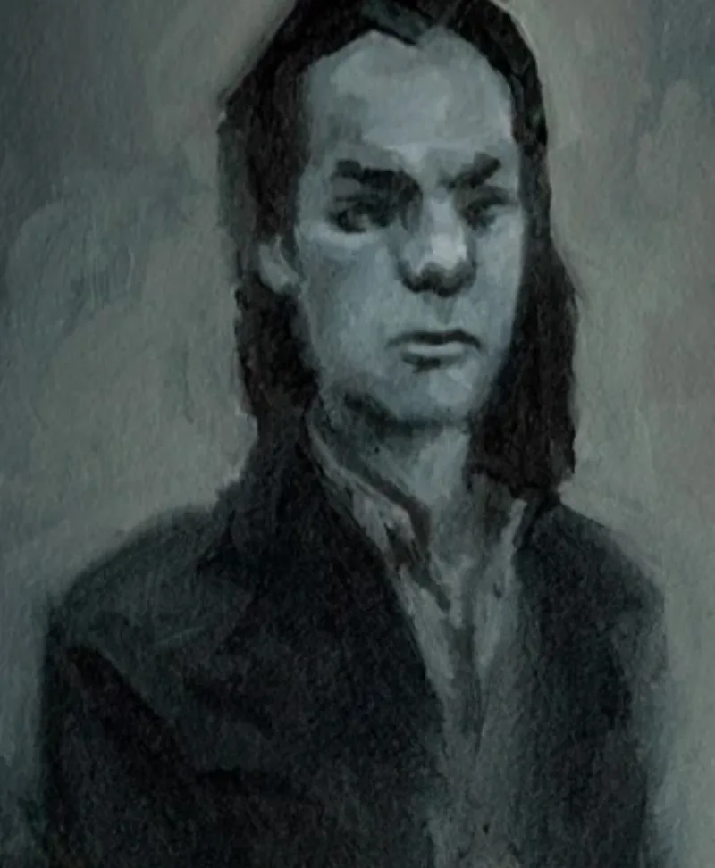

<dl>
<dt>Clan</dt><dd>Brujah</dd>
<dt>Generation</dt><dd>4th generation</dd>
<dt>Role</dt><dd>Brujah Methuselah</dd>
<dt>City</dt><dd>Chicago (torpid)</dd>
<dt>Embrace</dt><dd>931 B.C. (born 954 B.C.)</dd>
</dl>

Brujah Methuselah. Childe of Troile. 4th generation. Eastern Mediterranean descent. Wears a simple silver and onyx necklace engraved with Egyptian hieroglyphs — the onyx shaped as a tooth. Apparent age: 30s. **Humanity 10.** Willpower 10.

Auspex 6 (functions in torpor — his dreams are filled with distorted images of events around him), Dominate 6 (through touch, without eye contact), Thaumaturgy 7, Celerity 9, Potence 8, Presence 5, Fortitude 6, Animalism 5, Protean 5, Obfuscate 2. Intelligence 9.

## The Scholar-King (~954-931 B.C.)

Meneleus was king of a growing Greek merchant city roughly 800 years before the age of Pericles. Despite the burdens of the crown, he indulged his tastes in thought and beauty. Before turning thirty he had married one of the most beautiful women in Magna Graecia, built some of the finest buildings on the peninsula, supported distinguished philosophers, and begun collecting scrolls for what would become one of the world's largest libraries.

A rival city in Asia Minor harassed his merchants. Incidents escalated. The enemy city kidnapped his wife. Menele assembled a great fleet from allied Greek city-states and sailed east. The war lasted far longer than expected. The night before his planned triumphant entrance into the conquered city, he received a nocturnal visitor: Troile.

Troile — 3rd generation, the Antediluvian who had diablerized the clan founder Brujah — had traveled widely since the destruction of the Second City. He found the scholar-king most fascinating. They spent months in deep conversation. Troile decided Menele possessed all the elements worthy of immortality.

This is the World of Darkness refraction of the Trojan War. Meneleus is the Kindred echo of Menelaus of Sparta.

## Carthage (~800-146 B.C.)

A Brujah named Altamira told Menele of a place where Kindred and kine lived together — where vampires had found a way to control the Beast, where mortals and immortals labored together on great works of art, science, the occult, and the progression of the spirit. The mortals willingly spared blood; the immortals used their powers to make mortal life easier.

Menele was entranced. It was the embodiment of all his hopes and dreams.

He found Carthage to be everything Altamira had promised. As an experienced diplomat and famed orator, Menele became Carthage's envoy, trying to enlist Gangrel and Nosferatu support. He drew new Toreadors to the city — including the beautiful and powerful [Helena](/npcs/helena/).

[Helena](/npcs/helena/) betrayed Carthage. She and [Prias](/npcs/prias/) fled to Rome and gave the Ventrue the intelligence they needed to destroy the city. The legions salted the earth. They burned the library — over half a million volumes. Almost all the Brujah were destroyed.

Menele was away when it happened, trying to recruit help from the Gangrels of southern Africa. He returned to find only ruins. Unable to believe these were all that remained, he fled into the wilds of Western Europe, forswearing cities and civilization forever. He was the sole 4th-generation Brujah to survive the massacre.

*(Note: the Baali had corrupted Carthage from within. Troile himself had become blood-oath-bound to Moloch during a century of the demon's "friendship." When Carthage fell, the Brujah dream was already dying. Troile lies trapped beneath the salted earth.)*

## The Destruction of Pompeii (79 A.D.)

Menele broke his oath to forsake cities when he heard from a chance-met Gangrel about a beautiful Toreador ruling Pompeii. Knowing in his heart that this could only be [Helena](/npcs/helena/), he secretly visited. The sight of her ruling a Roman city — and the bitter memories of Carthage — were like a stake in his heart.

That night, Menele willingly entered his first Frenzy in a thousand years. His rage, coupled with a thaumaturgical ritual, brought down a spirit of fire to the city. It flew shrieking through the streets, free for the first time in centuries. The ground shook. The sky blew open. Fire poured down on Pompeii. All was destroyed.

Menele lost control of the spirit and escaped only by throwing himself into the harbor. He believed he had destroyed [Helena](/npcs/helena/). He was wrong.

## Thirteen Centuries of War (79-1415 A.D.)

[Helena](/npcs/helena/) survived through [Prias](/npcs/prias/)'s aid. They fled to Egypt. For over 1,300 years, the two Methuselahs fought across Eurasia. Neither could strike a decisive blow. [Helena](/npcs/helena/) slowly gained the upper hand as [Prias](/npcs/prias/) grew in power through millennia of feeding on her 4th-generation blood.

## The Escape to the New World (1415)

In a climactic battle near Agincourt, France, in 1415, Menele was dealt a near-fatal blow. He escaped with the aid of a force of knights he controlled. Phoenician legends of a land to the west prompted him to trick [Helena](/npcs/helena/) into thinking he was destroyed. Trusted retainers carried his body aboard a specially prepared ship which sailed westward.

[Critias](/npcs/critias/) — his childe, who did not know his sire still existed — had been compelled through the Blood Bond to finance a secret voyage by a sea-captain who believed the world was round. [Critias](/npcs/critias/) never heard from the captain again. He had unknowingly funded his sire's escape.

## The New World — Incas, Pueblos, Golconda

Once across the sea, Menele began to mold the Incans into a force capable of destroying his enemy. But as time passed, he was overtaken by the feeling that the ancient rivalry was nothing but a useless drag upon his spirit. He rejected his desire for revenge and created a civilization of great depth. He began to dream of creating a new Carthage.

[Helena](/npcs/helena/) followed with Cortez. She destroyed the Aztecs, then the Maya, then allied with Pizarro to destroy the Inca. Menele and his people proved no match for Spanish technology and Helena's horde of progeny. He barely escaped with his life and fled north.

He hid among the Pueblos. Helena found him; he fled without doing battle. He spent decades among the Plains Indians, living with them, learning the way of peace. He came closer to attaining Golconda than he ever had. The Uktena Garou tolerated his presence — they came to each other's aid and respected each other's rights. Within the heart of the village was a hollow mound that served as Menele's haven.

**Humanity 10.** The canonical stat block confirms it. A 4th-generation Methuselah with maximum Humanity — a creature pursuing transcendence while the world around him burned.

## Fort Dearborn (1832)

In 1820, they met again on the Kansas prairie. Menele fled to his friend, Chief Black Hawk. He hoped to turn Black Hawk's people into an effective fighting force — but had little knowledge of the destructive power of firearms.

At Fort Dearborn, Helena allied with the United States military. Menele with Black Hawk's warriors. The two Methuselahs met with all the pent-up fury of a whirlwind. The air turned red with the vast quantities of blood they used. Many Indians escaped the slaughter only because of a portentous blood-red tornado.

Helena dug her claws deep into Menele's ribs. With a scream of agony that made the earth shake, Menele drove his skull into her forehead. Both were thrown to the ground. Menele's remaining braves made a last desperate charge to rescue him, but [Prias](/npcs/prias/) drove a burning stake deep into the vampire's neck before they could reach him.

Both Methuselahs fell into torpor. [Prias](/npcs/prias/) took Helena to safety beneath the fort. At the cost of many lives, Menele's allies seized his body and escaped into the woods. Native American warriors have cared for the ancient since, tending his torpid body for over a century and a half.

## The Sleeping War — Chicago

From torpor, Menele called out to supporters around the world. His extra level of Auspex allows awareness of events around him while he sleeps — distorted, dreamlike, but functional. His Dominate works through touch without eye contact. The Bond carries his will to the surface through agents who do not feel the strings.

The war continued through proxies. Helena's forces centered around Prince [Lodin](/npcs/lodin/). Menele controlled the Anarchs through [Critias](/npcs/critias/) and Dominated the other clan leaders. Most battles revolved around each Methuselah's attempts to kill off the other's allies.

### The [Maldavis](/npcs/maldavis/) Sacrifice (Council Wars, 1983-1987)

[Maldavis](/npcs/maldavis/) led a Brujah uprising against [Lodin](/npcs/lodin/). Menele sacrificed her — allowed her to fail — in order to make Helena believe she had taken control of [Annabelle Triabell](/npcs/annabelle-triabell/). Helena could not believe Menele would sacrifice such a powerful tool for any reason. The gambit worked.

During this period, his sleep was plagued with questions. As he traced the entire history of his Jyhad, a gnawing doubt welled up: *Were his actions his own? Did someone manipulate him as he manipulated others? Some even older and more powerful Vampire?* The thought assailed him and rode his dreams.

### The [Saul Osiecki](/npcs/saul-osiecki/) Gambit

Through correspondence between [Saul Osiecki](/npcs/saul-osiecki/) and Dr. Phillips (a close ally of [Critias](/npcs/critias/)), Menele learned of the biologist's work on a strain of mononucleosis virus designed to kill vampires. He manipulated events to direct this biological weapon toward the [Succubus Club](/locations/succubus-club/) — Helena's base.

### [The Heart](/locations/the-heart/) of Osiris (Coptic Jar)

A Coptic jar containing [the Heart](/locations/the-heart/) of Osiris surfaced in Chicago. Channeling its energy would enable Menele to awaken at full strength — unstoppable, a god in the modern world. [Inyanga](/npcs/inyanga/) pursued it on his behalf. [Critias](/npcs/critias/), after breaking free of the Blood Bond by falling 73 stories from the [Sears Tower](/locations/sears-tower/), tried to prevent Menele from obtaining it. Beckett, the Noddist scholar, became entangled in the search.

[Critias](/npcs/critias/), newly free: *"It took the massive injuries I sustained from that accident to break free of my sire's influence. I, like many other Cainites in this city, have been Menele's unwitting agent for some time now. It has been thus for over two millennia."*

## The Network

**[Critias](/npcs/critias/)** (5th gen) — his childe, Embraced in the baths of Athens ~400 BC after a night debating the nature of existence. Blood-Bonded through centuries of feeding on his sire's blood. The "Brujah School," the Path of Entelechy, the vision of Chicago as the new Carthage — convictions [Critias](/npcs/critias/) considers his own philosophical legacy. They originate from Menele's sleeping mind. Critias does not realize his sire survived Carthage. *(In the V20 era, Critias broke free after nearly dying. Whether the Bond has been re-established is unclear.)*

**[Inyanga](/npcs/inyanga/)** (6th gen) — fell under Menele's control shortly after arriving in Chicago. Extended Domination, not Blood Bond. Through her, Menele commands the entire Gangrel clan. If word comes from [Inyanga](/npcs/inyanga/), every Gangrel mobilizes. Her Laibon immigration operation through [Lucian](/npcs/lucian/)'s docks in Gary moves bodies and resources through Menele's corridor. She is not actually Gangrel — she is Laibon, operating under Kindred cover.

**[Annabelle Triabell](/npcs/annabelle-triabell/)** (6th gen) — the deepest play. Menele's double agent inside Helena's camp. Helena believes she controls [Annabelle](/npcs/annabelle-triabell/) through Domination. Through [Annabelle](/npcs/annabelle-triabell/), Menele has a window into everything Helena's network does.

**[Khalid](/npcs/khalid-al-rashid/)** (Nosferatu Primogen) — initially independent. Each Methuselah assumed the other controlled him. In the V20 era, Critias claims: "Despite his claims, [Khalid](/npcs/khalid-al-rashid/) is as much a creature of Menele's now as I once was."

**[Ublo-Satha](/npcs/ublo-satha/)** — sleeper agent inside the Tremere. A Gargoyle conditioned by Menele before her transformation — the dormant commands survived the process. Her dual loyalty is unknown to the Tremere hierarchy. She watches [Nicolai](/npcs/nicolai/) (Helena's controlled Tremere Regent) from within the Chantry.

**[Annabelle](/npcs/annabelle-triabell/) → [Modius](/npcs/modius/)** — [Annabelle](/npcs/annabelle-triabell/) sired the Prince of Gary. Gary is not exile. Gary is a staging ground.

**[Annabelle](/npcs/annabelle-triabell/) → [Sharon](/npcs/sharon-payne/) → [Michael](/npcs/michael/) → [Sable](/sable-price/)** — four steps from a sleeping god.

**[Heath Quinn](/npcs/heath-quinn/)** — mortal operative. Carried Menele's blood to London in 1969. Shot [Roarke](/npcs/roarke/), fed him 4th-gen vitae. The twenty-year weapon: [Roarke](/npcs/roarke/) returned to Chicago, lived among the Anarchs, found the torpid Methuselah, kidnapped [Lodin](/npcs/lodin/). One move in a four-thousand-year chess game.

**[Roarke](/npcs/roarke/)** — kidnapped [Lodin](/npcs/lodin/) on New Year's Eve 1990. Built a cult in the woods around Menele's torpid body. While [Roarke](/npcs/roarke/) thought he was using the Ancient, the Ancient was using him.

### The Path of Entelechy

Menele sponsors this philosophical path worldwide, even from torpor. He communicates psychically with followers in Greece and Turkey, guiding candidates to philosophy teachers. Training takes place in small ruined temples in northern Greece and on the island of Crete. Each teacher takes a maximum of three pupils. All four extant Cretan teachers are ancillae. Three essential concepts: Enkrateia (inner strength), Arete (courage), Sophrosyne (control of the self) — once the essential characteristics of Brujah Embrace candidates.

Those who guide the cult look forward to the day when the Brujah may once again take their place as leaders among the Damned. Some fear that time grows short.

## The Doubt

As Menele traced the entire history of his Jyhad, a gnawing question arose: *Were his actions his own? Did someone manipulate him as he manipulated others? Some even older and more powerful Vampire — his arch-enemy?*

The thought assailed him and rode his dreams. He plays to ensure his own control, doing everything in his power to prove that he still has free will. The manipulator fears he is being manipulated. The puppet-master suspects he is a puppet.

Beckett, after nearly being Dominated by Helena in the [Succubus Club](/locations/succubus-club/): *"The power required to manipulate three ancient Cainites, not to mention a score of lesser creatures, would be staggering."*

**Nature:** Visionary. **Demeanor:** Architect.

**Lineage:** Menele → Troile (3rd gen, Antediluvian) → Brujah (Clan Founder). Downward: Menele → Critias (5th) → Procet (6th) → Albertus Magnus (7th).
