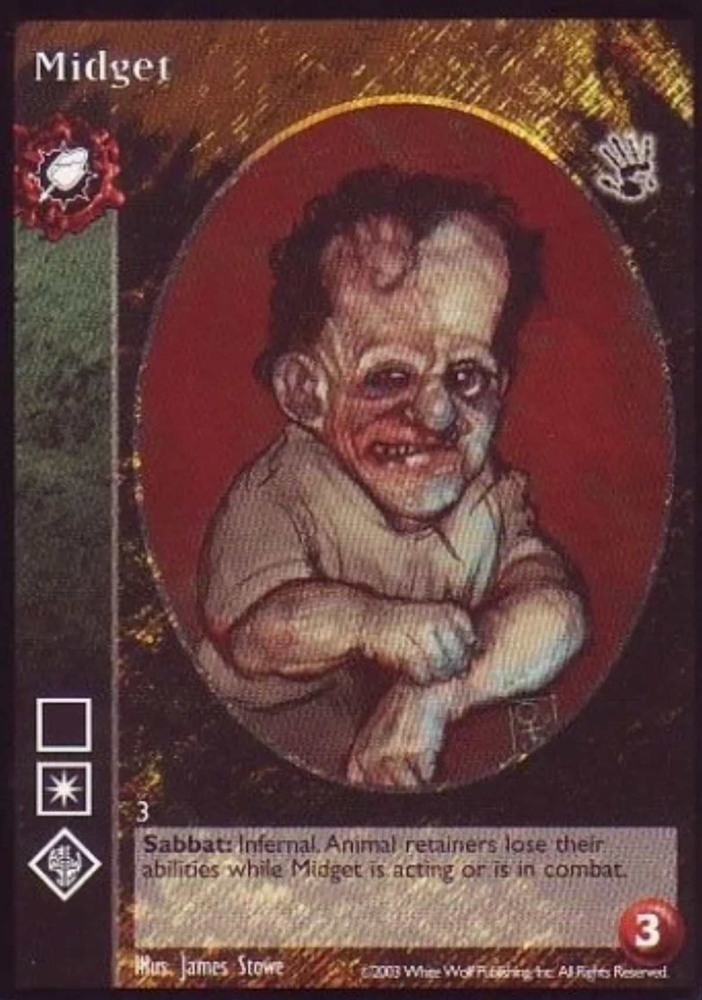

<dl>
<dt>Clan</dt><dd>Malkavian antitribu</dd>
<dt>Generation</dt><dd>11th generation</dd>
<dt>Role</dt><dd>Infernalist agent, circus member</dd>
<dt>City</dt><dd>Montreal</dd>
</dl>

Midget is a mere 4'1" tall and relishes in the gawks and leers he gets from people. No one knows where or by whom Midget was Embraced. [Zarnovich](/npcs/zarnovich/) found him in the 1970s, and Midget has been a member of the circus ever since. Midget is an outsider among outsiders. He rarely attends his pack's rites and has shared in the Vaulderie only twice. Midget also has the habit of disappearing for long periods of time, when no one, not even [Zarnovich](/npcs/zarnovich/)'s creations, can find him.

[Zarnovich](/npcs/zarnovich/) mistakenly attributes his covenmate's erratic behavior to his Malkavian nature. Unbeknownst to all, Midget is a follower of the Path of Evil Revelations and a faithful servant to [Pierre Bellemare](/npcs/pierre-bellemare/). He is setting up a cult for his master and gathering the tools his master needs. Midget also serves as an intermediary between [Pierre](/npcs/pierre-bellemare/) and the Tremere of Quebec.

**Image:** Midget's short body is completely out of proportion. His arms and feet are different lengths; his face is asymmetrical; his left eye is larger than his right; and his mouth is off-center, which gives him a perpetual grin.

**Secrets:** Midget has a bitter hatred for the Sabbat. His unknown sire must have Embraced him out of cruelty. Midget is a follower of the Path of Evil Revelations and serves [Pierre Bellemare](/npcs/pierre-bellemare/) as an infernal agent. He is responsible for the disappearances of Lavour and Goliath from the circus -- they were made sacrifices to Pierre's infernal master.
