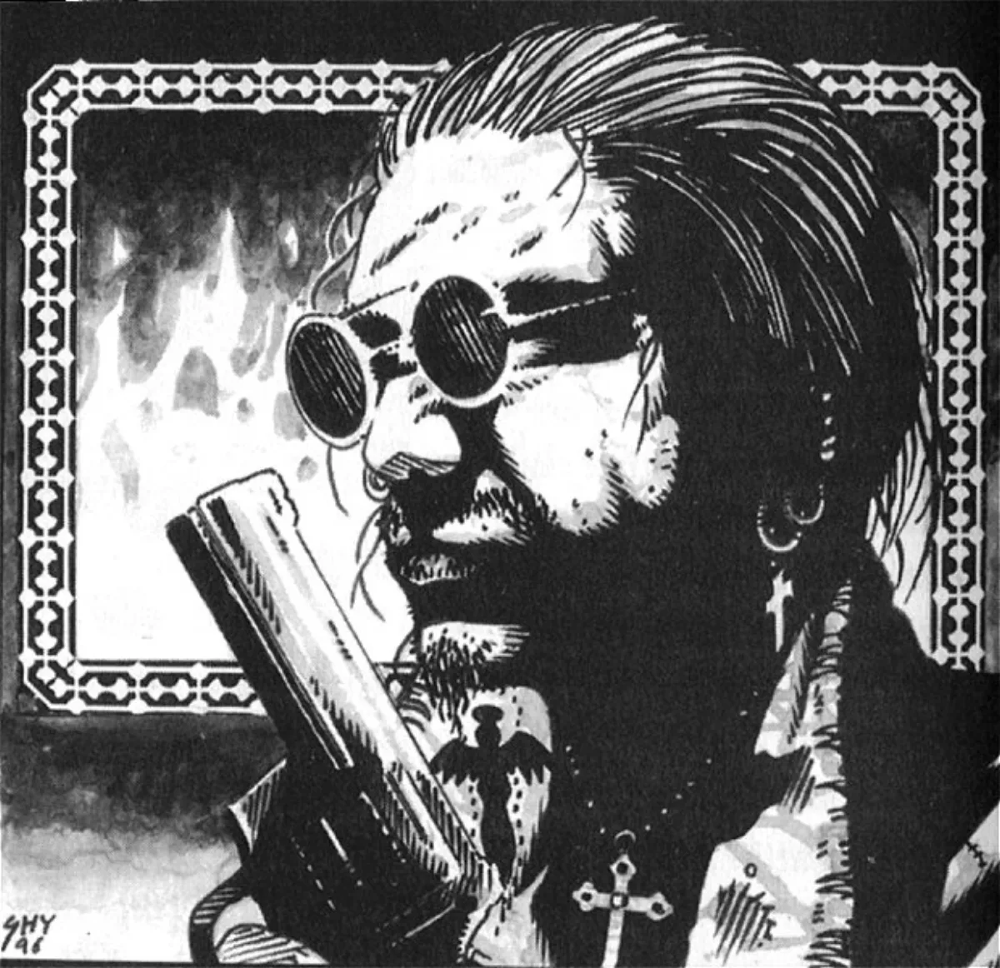

<dl>
<dt>Clan</dt><dd>Brujah antitribu</dd>
<dt>Generation</dt><dd>7th generation</dd>
<dt>Role</dt><dd>Pack Priest, Navigators</dd>
<dt>City</dt><dd>Montreal</dd>
</dl>

DeSoto Embraced Miguel -- then a small-time bandit in 1920s Brazil -- because he recognized a buccaneer who sought freedom from the laws of man. As a vampire, Santo Domingo reveled in the Sabbat's philosophies and joined the Path of Honorable Accord. He soon sensed that his sire was only interested in his own power, though. DeSoto brought the pack to Montreal in 1957, and he prepared his childe to follow in his footsteps. Miguel became pack priest in 1969 when DeSoto joined the Inquisition. He has reformed the Navigators in his image, dedicating the pack to uncovering hidden agendas among the Sabbat. DeSoto's secluded retirement only confirms Miguel's suspicions that his sire has dubious motives.

**Image:** A strapping 6'4" tall, Miguel is a dynamic figure. His cropped black hair tops a wide face. He has a quick smile and predatory eyes. He almost always dresses casually.

**Secrets:** Miguel suspects "DeSoto" (actually Sangris in DeSoto's body) of harboring dark secrets. The Navigators oppose conspiracies in the Sabbat, including those of the Inquisition. They currently support Archbishop Valez, mostly out of distrust of the Black Hand and the Shepherds.
