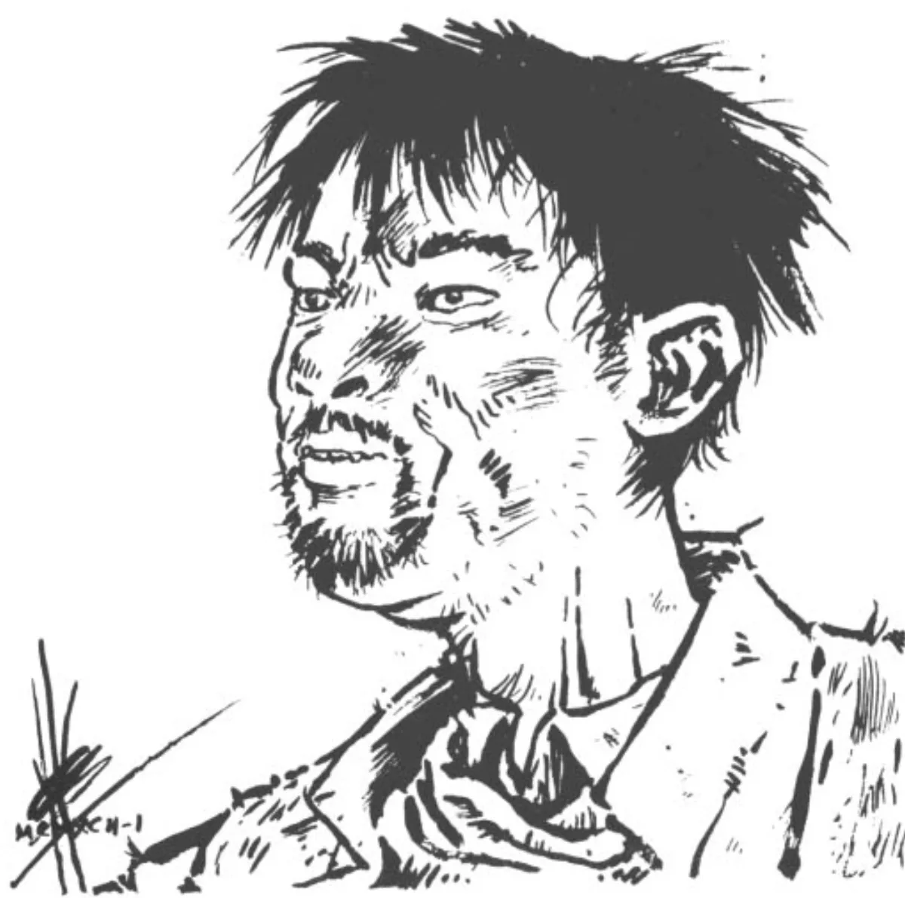

<dl>
<dt>Clan</dt><dd>Malkavian</dd>
<dt>Generation</dt><dd>11th generation</dd>
<dt>Role</dt><dd>Malkavian outcast</dd>
<dt>City</dt><dd>Milwaukee</dd>
</dl>

Embraced in 1977 by Mon Cheri. Milo was high on angel dust and purple microdots in the asylum when his sire fed on him and inadvertently Embraced him during a schizophrenic episode. The Prince of Chicago ruled him an innocent victim, executed his sire, and banished him. He fled to Milwaukee.

Wandering the storm drains near the lake, Milo claims to have discovered something — a creature or entity that chases him and has sworn to destroy all Kindred. He babbles about it constantly, sometimes coherently, sometimes not. No other Kindred believes him.

Japanese descent, short black hair, black eyes. Looks homeless — torn, dirty clothes. Were it not for his almost handsome voice, he could be confused for a Nosferatu. Never stays in the same haven twice.

**Apparent Age:** 32
**Embrace:** 1977
