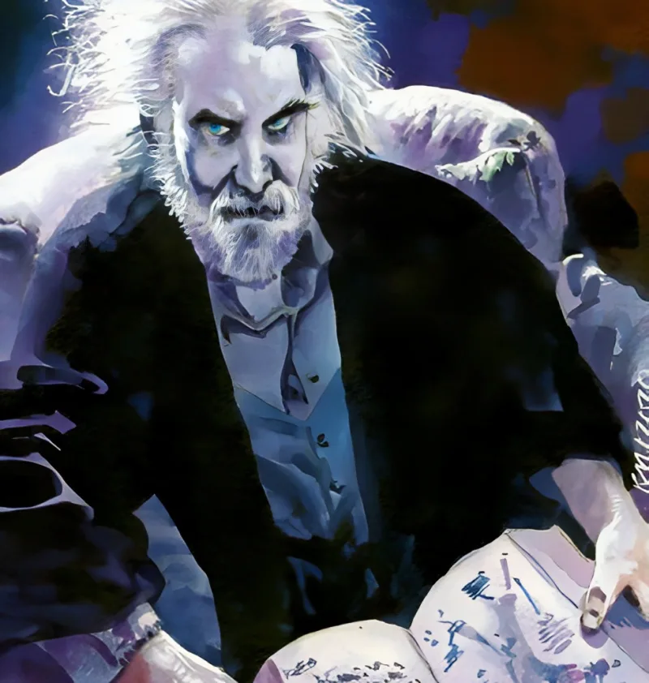

<dl>
<dt>Clan</dt><dd>Toreador</dd>
<dt>Generation</dt><dd>7th generation</dd>
<dt>Role</dt><dd>Prince of Gary</dd>
<dt>City</dt><dd>Gary</dd>
</dl>

**Humanity 4. Willpower 5.** Lower than expected — more desperate and less disciplined than his mask suggests. The Willpower especially is telling: he crumbles under sustained pressure.

Sired by [Annabelle Triabell](/npcs/annabelle-triabell/), Toreador Primogen of Chicago. Gary's Prince is the childe of a Chicago Primogen — a leash neither of them acknowledges in public.

Embraced in the nineteenth century. Claims involvement in founding the Arcanum. Claims acquaintance with every literary and occult figure of the 1800s and early 1900s. The claims are unverifiable and inexhaustible.

Failed attempt to seize Chicago praxis in 1913. [Lodin](/npcs/lodin/) pushed him to Gary. Starting in 1921, [Lodin](/npcs/lodin/) sent [Ballard](/npcs/ballard/) and [Capone](/npcs/capone/) against him — the Interdiction, a slow economic strangulation that gutted Gary's industrial base over forty years. Modius did not lose a war. He lost a siege he never understood was happening.

Sources disagree on his appearance. Some describe a former French-African colonial. Others describe a stately white man of average height in his early forties. The Dust to Dust account says he looks like Albert Einstein in expensive but outdated clothing. Whatever the truth, the vanity is consistent.

Possesses Thaumaturgy 1 (Path of Blood) and the ritual Defense of the Sacred Haven — unusual for a Toreador and likely acquired through a favor he does not discuss.

Feeds by Dominating homeless people in ritualistic patterns — same locations, same nights, same routines. The predictability makes him vulnerable to anyone patient enough to map his movements. [Sullivan Dane](/npcs/sullivan-dane/), for instance.

Has historically Dominated Black men as servants. [Juggler](/npcs/juggler/) considers this evidence that elder vampires forget what century they inhabit. The habit persists.

The siring pipeline: [Lodin](/npcs/lodin/) banned all siring in Chicago. Kindred wishing to Embrace transported their childer to Gary as a proving ground. Modius welcomed these neonates to thumb his nose at [Lodin](/npcs/lodin/) — this is why Gary has any Kindred population at all. Every dumped neonate is simultaneously a gift (bodies for his court) and an insult (Chicago's garbage).

Haven in a fortified mansion overlooking Miller Beach. Nature: Conniver. Demeanor: Cavalier (per Dust to Dust — the courtly front conceals something needier). Deeply lonely. Wavers between imperious and unctuous depending on whether he feels respected.
