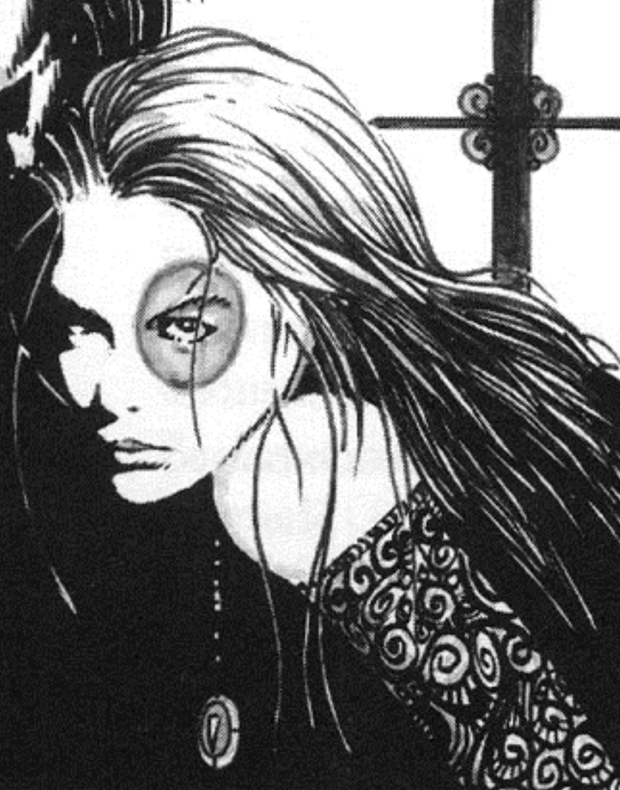

<dl>
<dt>Clan</dt><dd>Tzimisce</dd>
<dt>Generation</dt><dd>12th generation</dd>
<dt>Role</dt><dd>Librarian scribe, keeper of the Litany of Blood</dd>
<dt>City</dt><dd>Montreal</dd>
</dl>

The one certainty in life is death. That was Ellen Conlynne's philosophy. An Irish immigrant who arrived in Montreal in 1847, Ellen watched as her friends, family and shipmates died from the typhus epidemic that claimed many Potato Famine refugees. Ellen wept over every corpse cast over the side of the ship and for those who died waiting within the Grosse Ile quarantine station. People never realized that she wasn't mourning the passing of friends and loved ones, but that she was touched by the beauty of death. She even refuted God, believing that His existence marred the perfection of death itself.

Ellen's views on death and religion brought her to the attention of the Saint Patrick Basilica priests who believed she had been horribly alienated during the typhus epidemic. She was admitted into Hotel-Dieu Hospital.

Preacher, of Les Miserables, took an immediate liking to Ellen and brought her to a Creation Rite. Beatrice L'Angou and [Marie-Ange](/npcs/marie-ange-gagnon/) were also in attendance, both of whom instantly recognized the potential in the serene young woman. The two managed to convince Preacher to give them Ellen as a gift and Embraced her as a Tzimisce. Ellen emerged under the care of her stepmother Beatrice, her sire [Marie-Ange](/npcs/marie-ange-gagnon/) and her godfather Preacher.

Because Ellen, now called "Molly 8," believes that life is about constant change, she regularly sheds the outer layers of her skin and uses them as parchment for her writing. Molly 8 also uses her Necromancy skills to speak to the dead, and surpasses even Beatrice in the Discipline's use. Molly is the official scribe of the Librarians and in charge of creating new pages for the skintomes.

Molly 8's haven is covered from floor to ceiling with long, treated strips of human skin of various hues. These are her tapestries and pages; every square inch of her skin is covered with graceful script and artwork. Molly 8 maintains a close relationship with her "stepbrother" Skin.

**Image:** Due to constant shedding, Molly 8 is porcelain-skinned, soft-featured and without any blemishes. Her pale visage is framed by the tresses of her deep-red hair, which contrast with her green eyes.

**Secrets:** Molly 8 knows Marie-Ange is hiding someone in her lair, but has done nothing about it for the time being.
