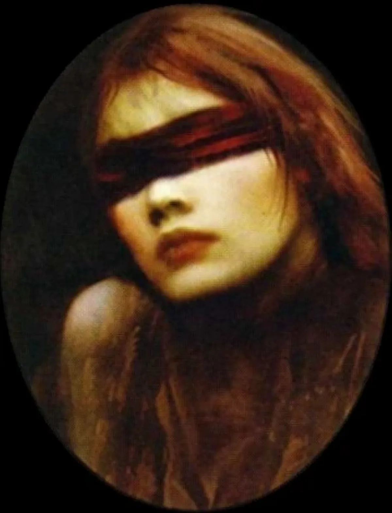

<dl>
<dt>Clan</dt><dd>Daughter of Cacophony</dd>
<dt>Generation</dt><dd>11th generation</dd>
<dt>Role</dt><dd>Enigmatic sewer wanderer, servant of Metathiax</dd>
<dt>City</dt><dd>Montreal</dd>
</dl>

Muse is one of the few enigmatic Sabbat to survive a Creation Rite on [Mount Royal](/locations/mount-royal/). Thought to have been Embraced prior to 1800 by a Daughter of Cacophony named Rita Du Mare, Muse vanished until 1847 when she was found in Pointe Saint-Charles, feeding on the victims of the typhus epidemic (6000 immigrants died between 1847 and 1848).

Muse's eyelids were fused shut through unknown means and could not be opened despite repeated attempts. She never spoke a word and only hummed a strange, soothing lullaby. Few realized that Muse was one of Metathiax's servants. Her eyes were sealed to ensure that she never witnessed the evil nature of her demonic keeper. Her power to soothe was used by the Decani to keep his herd of tortured creatures from becoming completely bestial.

Muse was put in Preacher's care until 1851, when a July fire destroyed a quarter of Montreal. She vanished during the confusion, but was seen multiple times at various quarantine stations during the cholera epidemic of 1854 and the typhus epidemic of 1918. It was later theorized that Muse may have been responsible for spreading various diseases across Montreal.

It was only in 1981 that [Elias the Whale](/npcs/elias-the-whale/) rediscovered Muse wandering through Montreal's sewer system. Muse was again taken into the fold of Les Miserables, but this time was allowed to remain in the sewers.

Muse spends her nights singing softly and wandering through the underground of Montreal. [Elias](/npcs/elias-the-whale/), who watches out for her when he can, suspects that she is singing a lullaby to the sewer system. As far as he can tell, she believes it is somehow alive, and she is singing to keep it from awakening. This thought frightens him -- it may not be the sewers that she keeps asleep, but something inside them.

**Image:** Muse is a beautiful woman despite the grime that cakes her face. Her hair is honey blond under its mat of filth. Her clothing is always tattered and torn. Muse's eyes are permanently fused shut (Vicissitude is suspected), and Elias has covered them with a red bandanna. The Cainite-leather jacket that Muse wears was last seen worn by [Veronique](/npcs/veronique/) La Cruelle on the night of the Setite attack in 1975 when the then-archbishop disappeared.

**Secrets:** Muse sings to keep Metathiax's creatures in check, and is secretly guarded by Leperhead, the Black Spiral Dancer.
