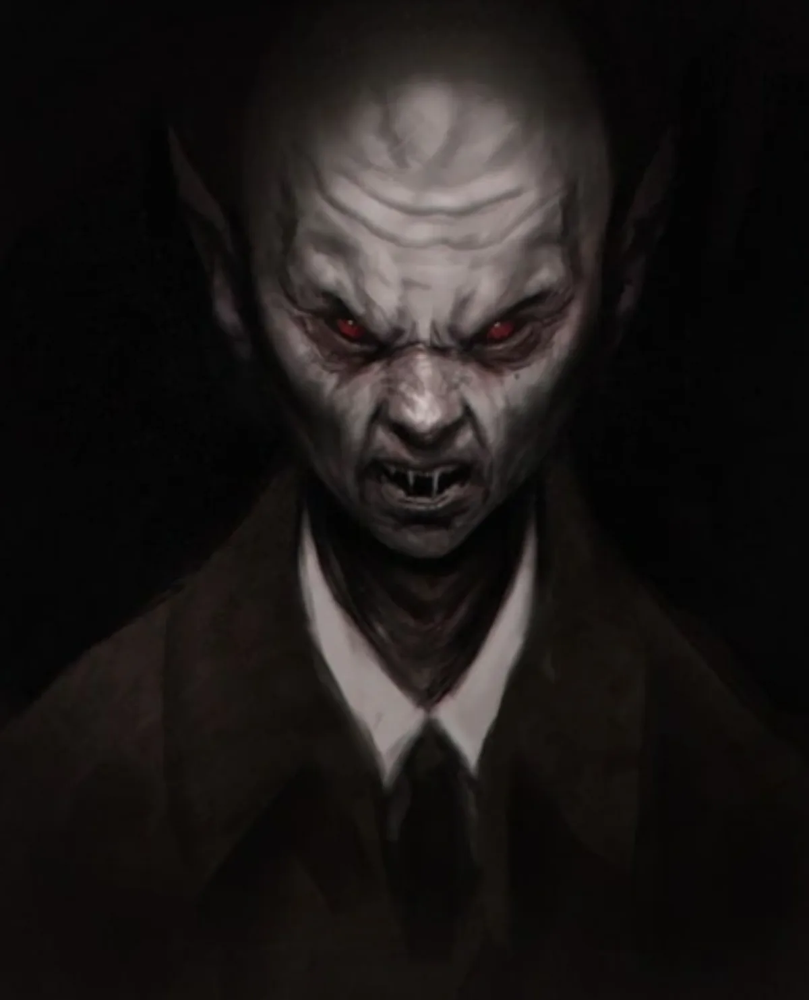

<dl>
<dt>Clan</dt><dd>Nosferatu</dd>
<dt>Generation</dt><dd>8th generation</dd>
<dt>Role</dt><dd>Former vampire hunter / double agent Nosferatu</dd>
<dt>City</dt><dd>Chicago</dd>
</dl>

For years, Nathaniel fought the demons and devils which plague the good people of New Orleans. An evangelist in the Church of Christ and the most-feared Vampire hunter in Louisiana during the 1920s, he managed to slay five of the city's Kindred during the span of just a few years. However, pride managed to worm its way into his bosom and replace faith, and Nathaniel finally met his match in the Bayous. In the swamps a crafty old Nosferatu trapped him in a deserted shack, and as a joke, turned the dread Vampire hunter into that which he most despised, leaving him outside a Church of Christ revival. None of the worshippers survived Nathaniel's waking Frenzy.

At first Nathaniel tried to make up for his actions by using his new-found powers to continue his war against the Undead. But it was not the same. There was no one to appreciate his theatrics and praise him for his bravery, and very quickly he discovered the weaknesses of his new form and the true power of the older Vampires. He fled New Orleans with its Prince's hellhounds baying at his heels.

During the years which followed Nathaniel has learned a great deal of patience, but his hatred of Vampires has continued to grow. After a disastrous encounter with the Sabbat in New York during the late 60s, he fled west to Chicago, then just recovering from its battles between the Prince and the Anarchs. Seeing which way the wind was blowing, he joined [Lodin](/npcs/lodin/)'s forces and contributed to the deaths of several surviving Anarchs. [Lodin](/npcs/lodin/) was delighted with Nathaniel's help and rewarded him with the right to make a Neonate (Elucid) as well as promoting him into the society of Elders. Soon thereafter, Nathaniel was approached by [Khalid](/npcs/khalid-al-rashid/) and initiated into the ways of the Nosferatu. After a very special private tour of the city in which he was shown the evil that [Lodin](/npcs/lodin/) had created, [Khalid](/npcs/khalid-al-rashid/) asked him to help keep tabs on the Prince.

Nathaniel happily assists both [Khalid](/npcs/khalid-al-rashid/) and [Lodin](/npcs/lodin/), and has become quite skilled at playing both ends against each other. He was careful to be out of town when [Maldavis](/npcs/maldavis/) made her bid for power, and very quick to return when the Primogen fell in behind [Lodin](/npcs/lodin/) once again -- just in time to help the Prince clean out some of the last Anarchs.

While both Lodin and [Khalid](/npcs/khalid-al-rashid/) count the old Vampire hunter among their allies, nothing would give him more pleasure than to kill them both. However, this hatred for Undead does not imply any mercy or compassion for the living. Nathaniel is among the most cold-blooded Vampires any character could meet. Unlike the other Nosferatu, Nathaniel has no special loyalty to his clan. He harbors only hatred for all his kind.

**Image:** A tall, gaunt Nosferatu.

**Roleplaying Hints:** Speak slyly and try to get the characters on your side. Then destroy them.

**Haven:** In the basement of a dilapidated Church of Christ church on the south side.

**Secrets:** B+
