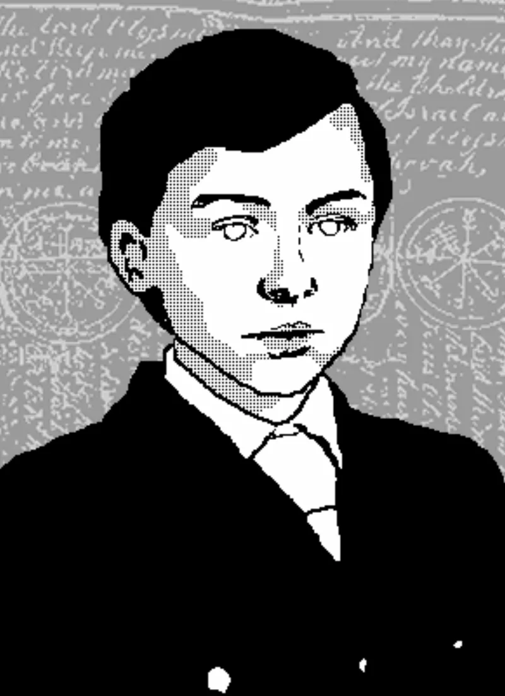

<dl>
<dt>Clan</dt><dd>Tremere</dd>
<dt>Generation</dt><dd>6th generation</dd>
<dt>Role</dt><dd>Tremere Regent</dd>
<dt>City</dt><dd>Chicago</dd>
</dl>

Born 1303 in rural Transylvania, then under the Hungarian Crown. His family were Romanian peasants — serfs in all but name, working vegetable plots on land they would never own. The Kingdom of Hungary had absorbed Transylvania after the Mongol withdrawal of 1242, and by the early fourteenth century the Romanian-speaking peasantry existed beneath a rigid social architecture of Hungarian nobility, Saxon merchants, and Székely frontier soldiers. The Romanians had no political standing. Nicolai's family worked the dirt and expected nothing else.

He was five years old when the Magus Stromberg appeared at the edge of the fields. A stranger in scholar's clothing, watching a child pull weeds. Stromberg spoke one sentence: "You will do. I shall return for you when you are older. You had best be prepared." Then vanished. Nicolai tried to tell his family what had happened and found his mouth would not open. The words died before they reached his tongue — Stromberg had sealed them with a minor enchantment. The boy spent three years watching the treeline, waiting, knowing he did not belong in the fields. Not arrogance. Certainty planted by someone else's magic.

Stromberg returned when Nicolai was eight. Wrapped the boy in a black cloak and walked him past the other peasants, who could not see either of them — Obfuscate, though Nicolai had no word for it then. They traveled into the Transylvanian hills to the Kundera Covenant, one of the Tremere's scattered chantry-fortresses. The Order of Hermes mages who would become Clan Tremere had seized vampiric immortality from the Tzimisce only two centuries earlier, around 1022, and their network of covenants served as laboratories, libraries, and staging grounds for an occult war that most of Europe never knew existed.

Four years as Stromberg's apprentice. The boy had genuine aptitude — quick recall, intuitive grasp of hermetic principles, and the relentless focus of a child who had been told at five that he was chosen. One night he heard Stromberg cry out from a chamber deep in the covenant. He found the old magus weeping over his dead familiar, a cat. Before Nicolai could speak, Stromberg seized him and bit deep into his throat. Drained him to nothing. The Embrace was not planned. It was grief and reflex and the unwillingness to lose a useful tool. Stromberg fed his own vitae back to the boy's corpse, and when Nicolai woke drinking blood, Stromberg explained: the Tremere had discovered immortality through vampirism. All the benefits, none of the weaknesses. A lie the boy would spend centuries unraveling.

He was eleven years old. He would be eleven years old forever.

Seven hundred years of loyal service followed. Stromberg's childe became Stromberg's instrument, then the Clan Elders' instrument, then — by the time the New World opened — an autonomous operative trusted with sensitive assignments far from Vienna's direct oversight. In 1869, the Tremere Council sent Nicolai to Chicago. The city was two years past the Great Fire and rebuilding at a pace that attracted capital, immigrants, and predators of every species. His mandate: establish Tremere presence, keep it hidden, and ensure that whatever prince ruled Chicago owed the Warlocks a debt. When Lodin challenged Maxwell for the princedom, Nicolai Dominated Maxwell's surviving supporters into passivity, handing Lodin a victory that looked inevitable but was manufactured. Lodin never forgot the debt. Nicolai never let him.

The apparent age remains the operational advantage. A ten-year-old boy in a room full of elders. Six centuries of Thaumaturgy and hermetic discipline housed in a body that never reached puberty. His Nature is Child — not metaphor, diagnosis. When his plans are thwarted, the response is not strategic recalibration but irrational fury, the tantrum of an eight-year-old who was promised he was special and cannot tolerate evidence to the contrary.
