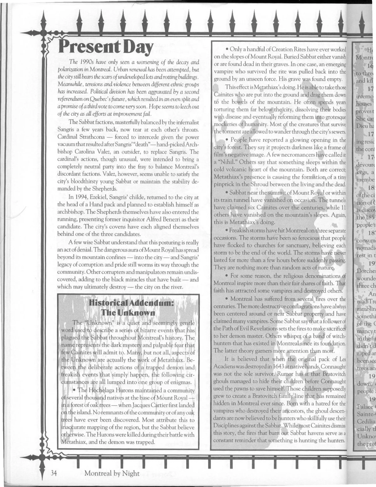

<dl>
<dt>Clan</dt><dd>Serpents of the Light</dd>
<dt>Generation</dt><dd>10th generation</dd>
<dt>Role</dt><dd>Memory thief, Widows member (as "Black Lotus")</dd>
<dt>City</dt><dd>Montreal</dd>
</dl>

Nina Barker was the daughter of a renowned biblical scholar. Her father traveled the world teaching and researching, often neglecting his daughter in the process. Nina spent her childhood years in boarding school and her summers with her father, away from other children. When she turned 18, her father sent her to Europe, where she stayed in the best hotels and "out of her father's hair." Nina tried desperately to attract her father's attention with suicide attempts, middle-aged lovers and drugs, but nothing turned his eyes from his books.

One night in Amsterdam, a Serpent of the Light found her nearly dead after having been raped in a dark alley. The Serpent was so impressed by her degradation that he Embraced her, performing her Creation Rite in the basement of an old house that was used as a morgue during World War II.

Nina went on to become one of the cruelest, most militant Sabbat in Amsterdam. Her first action as a vampire was to track down her father and present herself as the monster she had become. Her father tried to use his faith to drive her back, but she Dominated him into forgetting his precious religion. Over the following nights, Nina carefully stripped every shred of information from her father's memory. She left him an empty and hollow man.

In the early '80s, Nina traveled to Montreal to meet the Widows. No stranger to games of passion, she solicited the Widows' favors. Nina presented her father as a tribute to them. Nina has been a member ever since, using the name "Black Lotus." Though not a Cathar, she has incorporated a number of Cathari beliefs into her own pursuit of Power and the Inner Voice.

Nina is a destroyer of ideas. She takes pleasure in stripping people -- especially educated men -- of their memories and everything they have learned. This has put her at odds with the Librarians, who want nothing short of her destruction.

**Image:** Nina has retained her youthful and innocent appearance. She looks much younger than she really is. Her delicate frame is deceiving, hiding the cruel monster that lurks within.

**Secrets:** Nina knows a substantial amount about the Shepherds, especially from Raphael, who visits her on a regular basis. Unbeknownst to all of her customers, Nina has a habit of stealing their pasts, one memory at a time.
