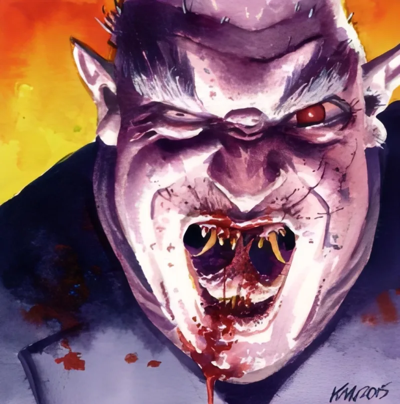

<dl>
<dt>Clan</dt><dd>Nosferatu</dd>
<dt>Generation</dt><dd>7th generation</dd>
<dt>Role</dt><dd>Sabbat Spy</dd>
<dt>City</dt><dd>Milwaukee</dd>
</dl>

Military officer in Ivan the Great's army. Skilled at spotting spies — interrogation, counter-intelligence, the patient work of separating loyal men from traitors. Embraced in 1467 by a Nosferatu named Boronisk who had committed diablerie and was fleeing the consequences.

Boronisk and Parovich joined Anarch packs during the Revolt. Boronisk fell in battle against Josef von Bauren, one of the Camarilla's founders. Watching his sire destroyed by the establishment drove Parovich into the Sabbat's arms. After the Convention of Thorns, he convinced a brood of Nosferatu to become antitribu — the first defection of its kind within the clan.

His infiltration of Milwaukee has been running for approximately thirty years. He feeds intelligence to the Black Hand and prepares the city for an invasion signal. Every Council meeting, every defensive plan, every internal fracture — catalogued, coded, and shipped east through sewer couriers and trained animals. The patience of a man who spent his mortal life catching spies, now turned to being one.

His childe Kristian discovered the secret and fled into Milwaukee's tunnel network. Parovich has summoned Nosferatu antitribu to hunt Kristian in the sewers. If they fail to silence him, Parovich signals the Sabbat to move on Milwaukee immediately — a forced timetable that benefits no one, but exposure benefits him less.

Confirmed as a Sabbat agent by two independent sources: **Lore of the Clans** and **Beckett's Jyhad Diary**, where Beckett left a letter for Decker exposing Parovich by name.
