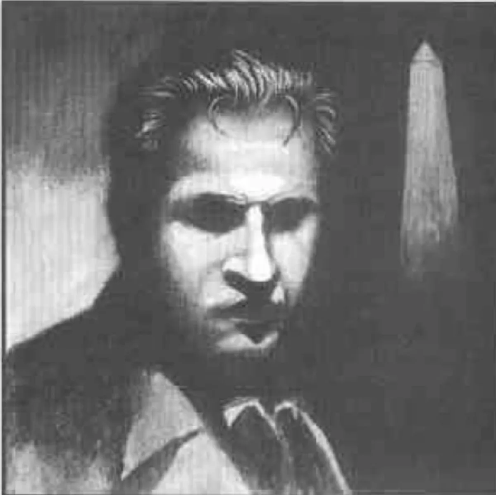

<dl>
<dt>Clan</dt><dd>Nosferatu</dd>
<dt>Generation</dt><dd>7th generation</dd>
<dt>Role</dt><dd>Abused child Nosferatu / half of [Khalid](/npcs/khalid-al-rashid/)'s twin childer</dd>
<dt>City</dt><dd>Chicago</dd>
</dl>

Peter and his sister Tammy grew up in a lower-middle-class immigrant neighborhood in South Chicago. Outwardly, theirs appeared a normal family, but it hid a dark secret of pain, humiliation and sadism. Not a week went by without the children's drunken parents finding an excuse to punish the two. The marks left by the punishments included giant welts and scars from belts and straps, cigarette burns, broken bones, concussions and more bruises than either child could ever count.

In 1950, when Peter was 13 and Tammy was 12, they found the first comfort of their lives in each other's arms. For a year, the continuing punishments meant little as long as they had each other. One night, the two were five minutes late coming home. Their parents locked Peter in a closet with dire threats about the punishment that awaited him. Then they beat Tammy for two hours. At the end, their drunken parents collapsed into bed and passed out. Tammy crawled to the closet and let Peter out. Peter helped Tammy outside, then emptied his parents' entire liquor cabinet outside their room and in the hallway which led to the front door. Then he lit a match.

The children watched the fire from the sidewalk in front of the house. They were so close the heat was slowly melting their shirt buttons. They heard their father screaming for help, and then there was nothing. A minute later, they became aware of a presence behind them.

[Khalid](/npcs/khalid-al-rashid/) had been watching the two children for almost five years. Their suffering had both fascinated and repulsed him. He concluded that he must Embrace them, both to save them and to preserve their pain for eternity -- for he would never Change anyone who had a hope of a full and peaceful mortal life; only those who would be enriched by the gift of becoming Nosferatu. He brought the two children to his Haven and spoke softly to them. Within a few hours they had accepted his gift.

They lived with [Khalid](/npcs/khalid-al-rashid/) for several more weeks as they discovered their new abilities. They found themselves constantly going by their old home during their nocturnal journeys, and finally returned there to sleep in the basement of the burned-out shell. Also in the ruins are the ghosts of their mother and father.

Peter and Tammy alternate their feedings between animals and adults. They will never feed on a child, and will seek to stop any Vampire from hurting children in any way. However, since the sight of a child being hurt is likely to send them into Frenzy, it is more than likely that they will kill the child they are trying to save. They can be found on the outskirts of Kindred society, looking on but never becoming involved. Though they commonly use Obfuscate to hide themselves, lately they have begun to let other Kindred catch glimpses of them; they wish to become a part of the community, but are too shy to ask.

**Notes:** Peter and Tammy have developed such a Blood Bond with each other that they now have the equivalent of Auspex 4 with respect to one another. They can read each other's auras and thoughts, tell what they have been doing by touch and can sometimes act as though they are one person. Their two retainers are the ghosts of their parents. The ghosts are unaffected by physical attacks, have the equivalent of Dominate 5 with seven dice, and a "touch" attack that drains Willpower (seven dice vs. victim's Wits + Dodge; every success drains one Willpower; Fortitude resists via Courage + Fortitude roll, target 9).

**Image:** A 4 ft 10 in Nosferatu.

**Roleplaying Hints:** Quiet and not willing to trust. No matter what he says, it generally sounds like a threat. [OCR unclear -- partial]

**Haven:** The burned-out shell of his old family home.

**Secrets:** B
